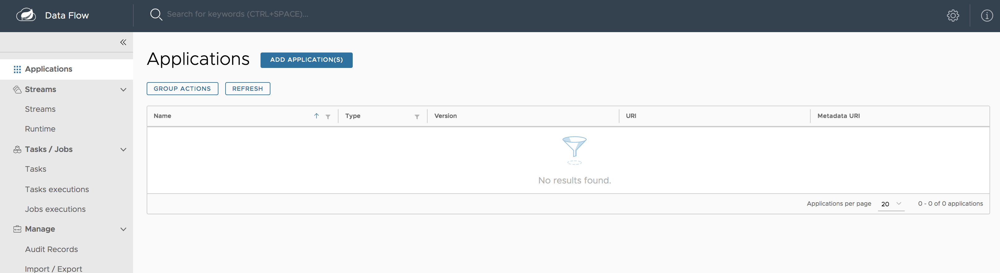
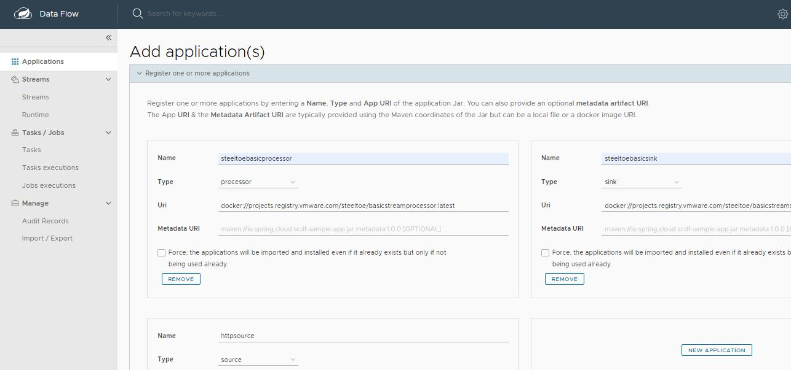
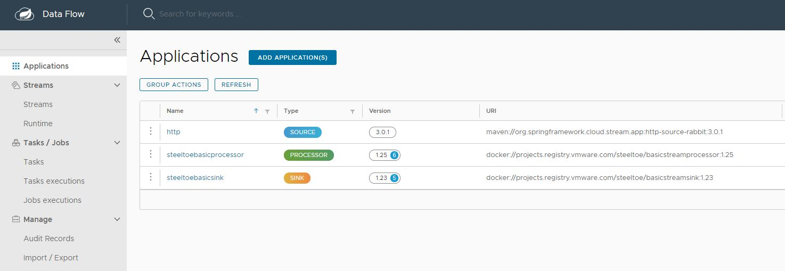
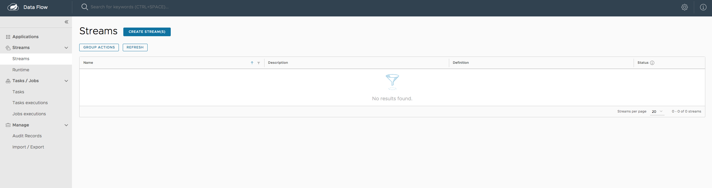
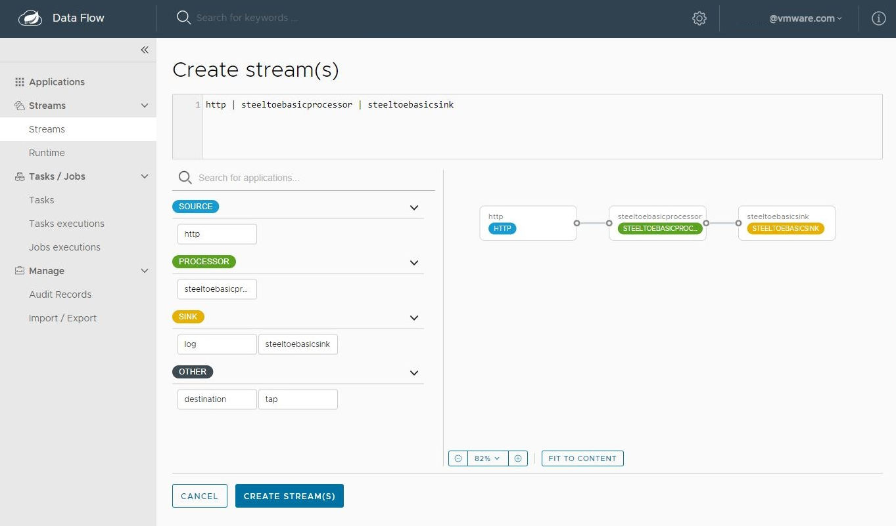
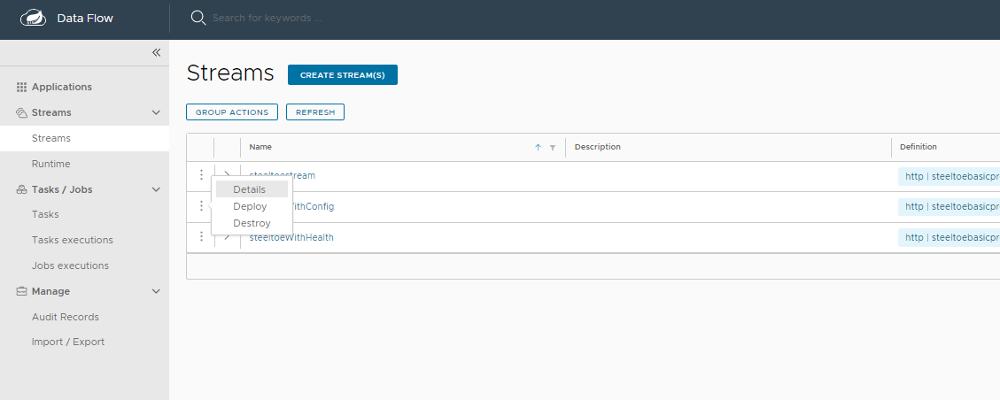
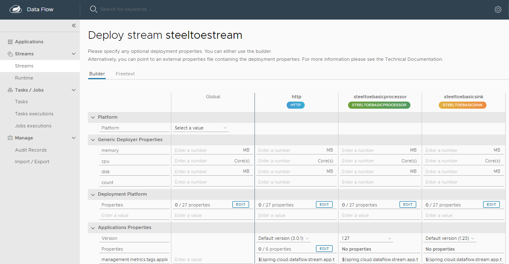
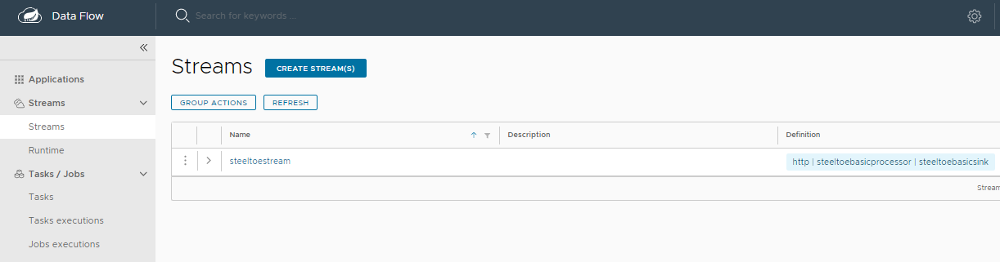
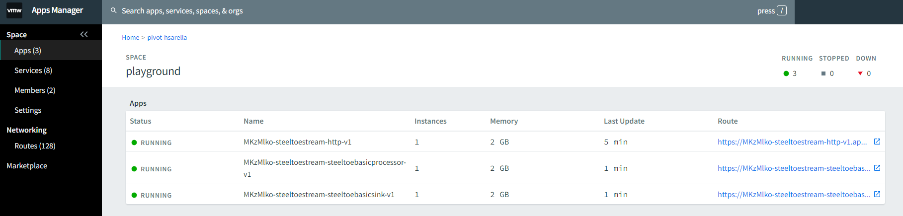
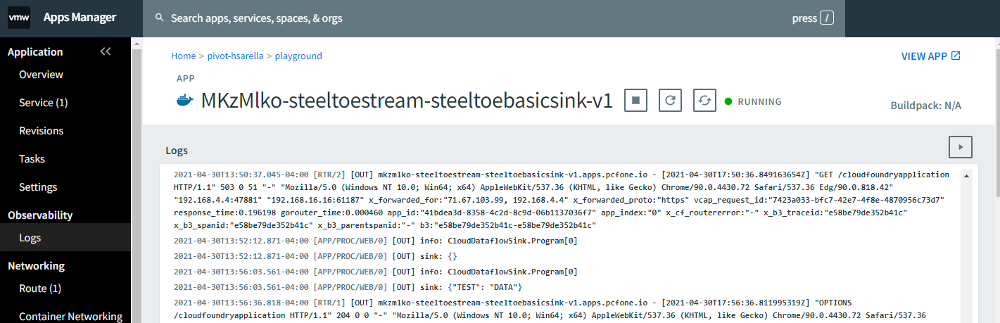

# Introduction
Spring Cloud Data Flow (SCDF) is a cloud-native orchestration service for composing microservice based applications on modern runtimes. With Spring Cloud Data Flow, developers can create and orchestrate data pipelines for common use cases such as data ingest, real-time analytics, and data import/export.


### Features

* Develop applications using DSL, REST-APIs, Dashboard, and the drag-and-drop GUI - Flo
* Create, unit-test, troubleshoot and manage microservice applications in isolation
* Build data pipelines rapidly using out-of-the-box stream and task/batch components
* Consume microservices written in Java or other languages as docker artifacts
* Scale data pipelines without interrupting data flows
* Orchestrate data-centric applications on a variety of modern runtime platforms including Cloud Foundry, Apache YARN, Apache Mesos, and Kubernetes
* Take advantage of metrics, health checks, and the remote management of each microservice application

# Deploying .NET Components to SCDF

Steeltoe Streams enables .NET components to run on SCDF by parsing and acting on the appropriate SCDF configuration parameters and binding the .NET application to the underlying message broker. .NET components built with Steeltoe are interoperable with their Java counterparts giving you the ability to leverage prebuilt components written in other languages (e.g. Java, etc.) and maintained by the Spring Cloud Data Flow team. To learn more about these components, SCDF team has an excellent guide that describes installing and deploying Java based applications on SCDF at the [Spring Cloud Data Flow Microsite](https://dataflow.spring.io/getting-started/). We encourage you to get familiar with that content.

This guide is focused on describing how you can deploy .NET based Streams components to SCDF and how you can easily combine them with already existing components written in other languages such as Java.

# Steeltoe Stream Processing with Data Flow and RabbitMQ

This section shows how to register stream applications with Data Flow, create a Stream DSL, and deploy the resulting applicaiton to Cloud Foundry, Kubernetes, and your local machine.

In our previous guides we created `ISource`, `IProcessor` and `ISink` .NET streaming components using Steeltoe and deployed them as standalone applications (i.e. not on SCDF). <!-- TODO: on multiple platforms. -->

In this guide, we describe how you can register these Steeltoe based components with Data Flow, combine them with other Java based components, create a Stream DSL to orchestrate their interactions, and deploy the final application to Cloud Foundry.<!-- , Kubernetes, and your local machine. -->

## Development

The [samples repo](https://github.com/SteeltoeOSS/Samples/tree/main/Streams) has a number of Steeltoe stream sample applications. For this example we will be using the `CloudDataFlowLogToUpperProcessor` sample, which implements an `IProcessor` interface and the `CloudDataFlowLogSink` sample, which implements an `ISink` interface.
For an `ISource` we will use the `HttpSource`  application available at 
```
maven://org.springframework.cloud.stream.app:http-source-rabbit:3.0.1 
``` 

Spring Cloud team publishes a number of sample applications as `maven` and `docker` artifacts at the `https://repo.spring.io` Maven repository. These pre-packaged applications can be used with Steeltoe Streams.

<!-- For the `UsageDetailSender` source, use one of the following:

```
maven://io.spring.dataflow.sample:usage-detail-sender-rabbit:0.0.1-SNAPSHOT
```

```
docker://springcloudstream/usage-detail-sender-rabbit:0.0.1-SNAPSHOT
```

For the `UsageCostProcessor` processor, use one of the following:

```
maven://io.spring.dataflow.sample:usage-cost-processor-rabbit:0.0.1-SNAPSHOT
```

```
docker://springcloudstream/usage-cost-processor-rabbit:0.0.1-SNAPSHOT
```

For the `UsageCostLogger` sink, use one of the following:

```
maven://io.spring.dataflow.sample:usage-cost-logger-rabbit:0.0.1-SNAPSHOT
```

```
docker://springcloudstream/usage-cost-logger-rabbit:0.0.1-SNAPSHOT
``` -->

### The Data Flow Dashboard

Assuming Data Flow is [installed](https://dataflow.spring.io/docs/installation/cloudfoundry/) and running <!-- TODO: on one of the supported platforms -->, open your browser at `<data-flow-url>/dashboard`. Here, `<data-flow-url>` depends on the platform. See the [installation guide](https://dataflow.spring.io/docs/installation/cloudfoundry/) to determining the base URL for your installation. 

<!-- TODO: If Data Flow is running on your local machine, go to http://localhost:9393/dashboard. -->

### Application Registration

Applications in Spring Cloud Data Flow are registered as named resources so that they may be referenced when you use the Data Flow DSL to configure and compose streaming pipelines. Registration associates a logical application name and type with a physical resource, which is given by a URI.

The URI conforms to a [schema](https://docs.spring.io/spring-cloud-dataflow/docs/current/reference/htmlsingle/#spring-cloud-dataflow-register-stream-apps).

As of 3.1.0-RC1 only Docker images are supported.

<!-- and may represent a Maven artifact, a Docker image, or an actual `http(s)` or `file` URL. -->
 Data Flow defines some logical application types to indicate its role as a streaming component, a task, or a standalone application. For streaming applications, as you might expect, we use `Source`,`Processor`, and `Sink` types.

The Data Flow Dashboard lands on the Application Registration view, where we can register the source, processor, and sink applications, as follows:



In this step, we register the applications we previously created.
When you register an application, you provide its:

- Location URI (Maven, HTTP, Docker, file, and so on)
- Application version
- Application type (source, processor, or sink)
- Application name

The following table shows the applications listed in the Samples:

| App Name               | App Type  | App URI                                                                      |
| ---------------------- | --------- | ---------------------------------------------------------------------------- |
| `basicstreamprocessor` | Processor | docker://projects.registry.vmware.com/steeltoe/basicstreamprocessor:latest |
| `basicstreamsink`    | Sink      | docker://projects.registry.vmware.com/steeltoe/basicstreamsink    |

<!-- NOTE -->

<!-- If you run the Spring Cloud Data Flow server on the Docker environment, make sure that your application artifact URIs are accessible.
For instance, you may not be able to access `file:/` from SCDF or Skipper Docker containers unless you have made the application locations be
accessible. We recommend using `http://`, `maven://` or `docker://` for application URIs. -->

<!-- END_NOTE -->

For this example, assume you run Spring Cloud Data Flow and Skipper servers on your Cloud Foundry environment.

You can register the `HttpSource` source application. To do so:

1. From the Applications view, select **ADD APPLICATION(S)**.
   This shows a view that lets you register applications.

1. Select **Register one or more applications** and enter the `name`, `type`, and `URI` for the source application.

1. Register the `docker` artifact of the `HttpSource` application named `http-source`, as follows:

   > (uri = `
source.http=docker:springcloudstream/http-source-rabbit:3.0.1`)

1. Click on **NEW APPLICATION** to display another instance of the form to enter the values for the processor.

1. Register the `docker` artifact of the `BasicStreamProcessor` processor application named `basicstreamprocessor`, as follows:

   > (uri = `docker://projects.registry.vmware.com/steeltoe/basicstreamprocessor:latest`)

1. Click on **NEW APPLICATION** to display another instance of the form to enter the values for the sink.

1. Register the `docker` artifact of the `BasicStreamSink` sink application named `basicstreamsink`, as follows:

   > (uri = `docker://projects.registry.vmware.com/steeltoe/basicstreamprocessor:latest`)

   

1. Click on **IMPORT APPLICATION(S)** to complete the registration. Doing so takes you back to the Applications view, which lists your applications. The following image shows an example:

   

### Creating the Stream Definition

To create the stream definition:

1. Select **Streams** from the left navigation bar. This shows the main Streams view, as follows:

   

1. Select **Create stream(s)** to display a graphical editor to create the stream definition, as the following image shows:

   

   You can see the `Source`, `Processor` and `Sink` applications, as registered above, in the left panel.

1. Drag and drop each application to the canvas and then use the handles to connect them together. Notice the equivalent Data Flow DSL definition in the top text panel.

1. Click `Create Stream`.

   You can type the name of the stream `basicsteeltoestream` when creating the stream.

## Deployment

To deploy your stream,

1. Click on the arrow head icon to deploy the stream. Doing so takes you to the Deploy Stream page, where you may enter additional deployment properties.

1. Select `Deploy`, as follows:

   

1. When deploying the stream, choose the target platform accounts from local, Kubernetes, or Cloud Foundry. This is based on the Spring Cloud Skipper server deployer platform account setup.

   

   When all the applications are running, the stream is successfully deployed.

   

<!-- TODO The preceding process is basically the same for all platforms. The following sections addresses platform-specific details for deploying on Data Flow on Local, Cloud Foundry, and Kubernetes. -->
<!-- >

TODO: Until we can deploy archive to scdf from dotnet apps, we cannot deploy to SCDF locally (using docker)

### Local

<!-- NOTE - ->

If you deploy the stream on the `local` environment, you need to set a unique value for the `server.port` application property for each application so that they can use different ports on `local`.

<!-- END_NOTE - ->

Once the stream is deployed on the `local` development environment, you can look at the runtime applications by using the dashboard's runtime page or by using the SCDF shell command, `runtime apps`.
The runtime applications show information about where each application runs in the local environment and their log files locations.

<!--NOTE- ->

If you run SCDF on Docker, to access the log files of the streaming applications, you can run the following command (shown with its output):

`docker exec <stream-application-docker-container-id> tail -f <stream-application-log-file>`

```
2019-04-19 22:16:04.864  INFO 95238 --- [container-0-C-1] c.e.demo.UsageCostLoggerApplication      : {"userId": "Mark", "callCost": "0.17", "dataCost": "0.32800000000000007" }
2019-04-19 22:16:04.872  INFO 95238 --- [container-0-C-1] c.e.demo.UsageCostLoggerApplication      : {"userId": "Janne", "callCost": "0.20800000000000002", "dataCost": "0.298" }
2019-04-19 22:16:04.872  INFO 95238 --- [container-0-C-1] c.e.demo.UsageCostLoggerApplication      : {"userId": "Ilaya", "callCost": "0.175", "dataCost": "0.16150000000000003" }
2019-04-19 22:16:04.872  INFO 95238 --- [container-0-C-1] c.e.demo.UsageCostLoggerApplication      : {"userId": "Glenn", "callCost": "0.145", "dataCost": "0.269" }
2019-04-19 22:16:05.256  INFO 95238 --- [container-0-C-1] c.e.demo.UsageCostLoggerApplication      : {"userId": "Ilaya", "callCost": "0.083", "dataCost": "0.23800000000000002" }
2019-04-19 22:16:06.257  INFO 95238 --- [container-0-C-1] c.e.demo.UsageCostLoggerApplication      : {"userId": "Janne", "callCost": "0.251", "dataCost": "0.026500000000000003" }
2019-04-19 22:16:07.264  INFO 95238 --- [container-0-C-1] c.e.demo.UsageCostLoggerApplication      : {"userId": "Janne", "callCost": "0.15100000000000002", "dataCost": "0.08700000000000001" }
2019-04-19 22:16:08.263  INFO 95238 --- [container-0-C-1] c.e.demo.UsageCostLoggerApplication      : {"userId": "Sabby", "callCost": "0.10100000000000002", "dataCost": "0.33" }
2019-04
```

END_NOTE -->

### Cloud Foundry

Before registering and deploying stream applications to Cloud Foundry by using the instructions shown earlier, you should ensure that you have an instance of Spring Cloud Data Flow running on Cloud Foundry. Follow the Cloud Foundry [installation guide](https://dataflow.spring.io/docs/installation/cloudfoundry/) for reference.

Once you have followed the steps shown earlier in this chapter and have registered the applications as well as deployed the stream, you can see the successfully deployed applications in your in your Org and Space in Cloud Foundry.



You can access the runtime information of your stream applications in the Spring Cloud Data Flow dashboard as well.

Besides verifying the runtime status of your stream, you should also verify the logging output produced by the `basicstreamsink` sink. In Cloud Foundry Apps Manager, click the **Logs** tab of the `basicstreamsink` sink application. 

 The logging statements should look like the following:



<!-- ### Kubernetes

Once you have the Spring Cloud Data Flow server running in Kubernetes (by following the instructions from the [installation guide](%currentPath%/installation/kubernetes/)), you can:

- Register the stream applications
- Create, deploy, and manage streams

#### Registering Applications with Spring Cloud Data Flow server

The Kubernetes environment requires the application artifacts to be `docker` images.

For the `UsageDetailSender` source, use the following:

```
docker://springcloudstream/usage-detail-sender-rabbit:0.0.1-SNAPSHOT
```

For the `UsageCostProcessor` processor, use the following:

```
docker://springcloudstream/usage-cost-processor-rabbit:0.0.1-SNAPSHOT
```

For the `UsageCostLogger` sink, use the following:

```
docker://springcloudstream/usage-cost-logger-rabbit:0.0.1-SNAPSHOT
```

You can register these applications, as described in the application registration step [described earlier](#application-registration).

#### Stream Deployment

Once you have registered the applications, you can deploy the stream per the instructions from the stream deployment section [above](#deployment).

##### Listing the Pods

To lists the pods (including the server components and the streaming applications), run the following command (shown with its output):

```bash
 kubectl get pods
```

```
NAME                                                         READY   STATUS    RESTARTS   AGE
scdf-release-data-flow-server-795c77b85c-tqdtx               1/1     Running   0          36m
scdf-release-data-flow-skipper-85b6568d6b-2jgcv              1/1     Running   0          36m
scdf-release-mysql-744757b689-tsnnz                          1/1     Running   0          36m
scdf-release-rabbitmq-5fb7f7f644-878pz                       1/1     Running   0          36m
usage-cost-logger-usage-cost-logger-v1-568599d459-hk9b6      1/1     Running   0          2m41s
usage-cost-logger-usage-cost-processor-v1-79745cf97d-dwjpw   1/1     Running   0          2m42s
usage-cost-logger-usage-detail-sender-v1-6cd7d9d9b8-m2qf6    1/1     Running   0          2m41s
```

##### Verifying the Logs

To be sure the steps in the previous sections have worked correctly, you should verify the logs.
The following example (shown with its output) shows how to make sure that the values you expect appear in the logs:

```bash
kubectl logs -f usage-cost-logger-usage-cost-logger-v1-568599d459-hk9b6
```

```
2019-05-17 17:53:44.189  INFO 1 --- [e-cost-logger-1] i.s.d.s.u.UsageCostLoggerApplication     : {"userId": "user2", "callCost": "0.7000000000000001", "dataCost": "23.950000000000003" }
2019-05-17 17:53:45.190  INFO 1 --- [e-cost-logger-1] i.s.d.s.u.UsageCostLoggerApplication     : {"userId": "user4", "callCost": "2.9000000000000004", "dataCost": "10.65" }
2019-05-17 17:53:46.190  INFO 1 --- [e-cost-logger-1] i.s.d.s.u.UsageCostLoggerApplication     : {"userId": "user3", "callCost": "5.2", "dataCost": "28.85" }
2019-05-17 17:53:47.192  INFO 1 --- [e-cost-logger-1] i.s.d.s.u.UsageCostLoggerApplication     : {"userId": "user4", "callCost": "1.7000000000000002", "dataCost": "30.35" }
``` -->

## Comparison with Standalone Deployment

In this section, we deployed the stream by using Spring Cloud Data Flow with the stream DSL:

```
http | steeltoebasicprocessor | steeltoebasicsink
```

When these three applications are deployed as standalone applications, you need to set the binding properties that connect the applications to make them into a stream.

Instead, Spring Cloud Data Flow lets you deploy all three streaming applications as a single stream by taking care of the plumbing of one application to the other to form the data flow.
