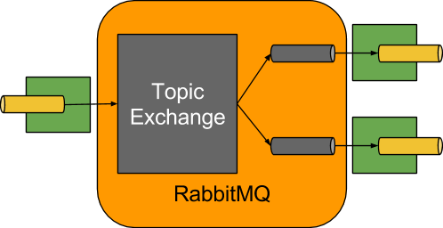

# Steeltoe Stream RabbitMQ Binder Reference Guide

This guide describes the RabbitMQ implementation of the Steeltoe Stream Binder, along with usage and configuration options, as well as information on how the Stream concepts map into RabbitMQ-specific constructs.

## Usage

To use the RabbitMQ binder, add it to your Stream application with a PackageReference in your `.csproj` as seen in this example:

```xml
<PackageReference Include="Steeltoe.Stream.Binder.RabbitMQ" Version="3.1.0" />
```

## RabbitMQ Binder Overview

The following simplified diagram shows how the RabbitMQ binder operates:



By default, the RabbitMQ Binder implementation maps each destination to a `TopicExchange`.
For each consumer group, a `Queue` is bound to that `TopicExchange`.
Each consumer instance has a corresponding RabbitMQ `Consumer` instance for its group's `Queue`.
For partitioned producers and consumers, the queues are suffixed with the partition index and use the partition index as the routing key.
For anonymous consumers (those with no `group` property), an auto-delete queue (with a randomized unique name) is used.

By using the optional `autoBindDlq` option, you can configure the binder to create and configure dead-letter queues (DLQs) (and a dead-letter exchange `DLX`, as well as routing infrastructure).
By default, the dead letter queue has the name of the destination, appended with `.dlq`.
If retry is enabled (i.e. `maxAttempts > 1`), failed messages are delivered to the DLQ after retries are exhausted.
If retry is disabled (i.e. `maxAttempts = 1`), you should set `requeueRejected` to `False`, the default, so that failed messages are routed to the DLQ, instead of being re-queued.
In addition, `republishToDlq` causes the binder to publish a failed message to the DLQ (instead of rejecting it).
This feature lets additional information, such as the stack trace in the `x-exception-stacktrace` header, be added to the message in headers.
See the `frameMaxHeadroom` setting below for information about truncated stack traces.
This option does not require retry to be enabled.
You can republish a failed message after just one attempt and you can configure the delivery mode of republished messages.
See the `republishDeliveryMode` setting below.

If a stream listener throws an `ImmediateAcknowledgeAmqpException`, the DLQ is bypassed and the message simply discarded. This is true regardless of the setting of `republishToDlq`.

>**IMPORTANT:** Setting `requeueRejected` to `True` (with `republishToDlq=False` ) causes the message to be re-queued and redelivered continually, which is likely not what you want unless the reason for the failure is transient.
In general, you should enable retry within the binder by setting `maxAttempts` to greater than one or by setting `republishToDlq` to `True`.

See [RabbitMQ Binder Settings](#rabbitmq-binder-settings) for more information about configuring these settings.

The framework does not provide any standard mechanism to consume dead-letter messages (or to re-route them back to the primary queue).
Some options are described in [Dead-Letter Queue Processing](#dead-letter-queue-processing).

<!-- //TODO:  Is this possible with Steeltoe????????????
>**NOTE:** When multiple RabbitMQ binders are used in a Stream application, it is important to disable 'RabbitAutoConfiguration' to avoid the same configuration from `RabbitAutoConfiguration` being applied to the two binders.
You can exclude the class by using the `@SpringBootApplication` annotation. -->

The `RabbitMessageChannelBinder` sets the `RabbitTemplate.userPublisherConnection` property to `True` so that the non-transactional producers avoid deadlocks on consumers, which can happen if cached connections are blocked because of a [memory alarm](https://www.rabbitmq.com/memory.html) on the broker.

<!-- // TODO: verify multiplex consumers work -->
>**NOTE:** Currently, a `multiplex` consumer (a single consumer listening to multiple queues) is only supported for message-driven consumers; polled consumers can only retrieve messages from a single queue.

## Configuration Settings

This section contains settings specific to the RabbitMQ Binder and associated channels.

For general binding configuration options and properties, see the [Steeltoe Stream Reference Documentation](./stream-reference.md).

### RabbitMQ Binder Settings

By default, the RabbitMQ binder uses the Steeltoe RabbitMQ `ConnectionFactory`.
Consequently, it supports all of the associated configuration settings for RabbitMQ.
For reference, see the [Steeltoe RabbitMQ Documentation](./stream-reference.md).
RabbitMQ configuration settings use the `spring:rabbitmq` prefix.

In addition to the RabbitMQ settings, the RabbitMQ binder supports the following configuration values.  All settings should be prefixed with `spring:cloud:stream:rabbitmq:binder`.

**adminAddresses**
A comma-separated list of RabbitMQ management plugin URLs.
Only used when `nodes` contains more than one entry.
Each entry in this list must have a corresponding entry in `spring:rabbitmq:addresses`.
Only needed if you use a RabbitMQ cluster and wish to consume from the node that hosts the queue.
See [Queue Affinity and the LocalizedQueueConnectionFactory](https://docs.spring.io/spring-amqp/reference/html/#queue-affinity) for more information.

Default: empty.

**nodes**
A comma-separated list of RabbitMQ node names.
When more than one entry, used to locate the server address where a queue is located.
Each entry in this list must have a corresponding entry in `spring:rabbitmq:addresses`.
Only needed if you use a RabbitMQ cluster and wish to consume from the node that hosts the queue.
See [Queue Affinity and the LocalizedQueueConnectionFactory](https://docs.spring.io/spring-amqp/reference/html/#queue-affinity) for more information.

  Default: empty.

**compressionLevel**
The compression level for compressed bindings.
See `System.IO.Compression.CompressionLevel`.

  Default: `1` (CompressionLevel.Fastest).

**connectionNamePrefix**
A connection name prefix used to name the connection(s) created by this binder.
The name is this prefix followed by `#n`, where `n` increments each time a new connection is opened.

  Default: none

### RabbitMQ Consumer Settings

The following properties are available for Rabbit consumers only and must be prefixed with `spring:cloud:stream:rabbitmq:bindings:<channelName>:consumer.`.

>**NOTE:** To avoid repetition, Stream supports setting values for all channels, in the format of `spring:cloud:stream:default:<setting>=<value>`.

**acknowledgeMode**
The acknowledge mode.

  Default: `AUTO`.

**anonymousGroupPrefix**
When the binding has no `group` setting, an anonymous, auto-delete queue is bound to the destination exchange.
The default naming strategy for such queues results in a queue named `anonymous.<base64 representation of a UUID>`.
Set this property to change the prefix to something other than the default.

  Default: `anonymous.`.

**autoBindDlq**
Whether to automatically declare the DLQ and bind it to the binder DLX.

  Default: `False`.

**bindingRoutingKey**
The routing key with which to bind the queue to the exchange (if `bindQueue` is `True`).
For partitioned destinations, `-<instanceIndex>` is appended.

  Default: `#`.

**bindQueue**
Whether to declare the queue and bind it to the destination exchange.
Set it to `False` if you have set up your own infrastructure and have previously created and bound the queue.

  Default: `True`.

**consumerTagPrefix**
Used to create the consumer tag(s); will be appended by `#n` where `n` increments for each consumer created.
Example: `${spring:application:name}-${spring:cloud:stream:bindings:input:group}-${spring:cloud:stream:instanceIndex}`.

  Default: `none` - the broker will generate random consumer tags.

**deadLetterQueueName**
The name of the DLQ

  Default: `prefix+destination.dlq`

**deadLetterExchange**
A DLX to assign to the queue.
Relevant only if `autoBindDlq` is `True`.

  Default: `prefix+DLX`

**deadLetterExchangeType**
The type of the DLX to assign to the queue.
Relevant only if `autoBindDlq` is `True`.

  Default: `direct`

**deadLetterRoutingKey**
A dead letter routing key to assign to the queue.
Relevant only if `autoBindDlq` is `True`.

  Default: `destination`

**declareDlx**
Whether to declare the dead letter exchange for the destination.
Relevant only if `autoBindDlq` is `True`.
Set to `False` if you have a pre-configured DLX.

  Default: `True`.

**declareExchange**
Whether to declare the exchange for the destination.

  Default: `True`.

**delayedExchange**
Whether to declare the exchange as a [Delayed Message Exchange](https://github.com/rabbitmq/rabbitmq-delayed-message-exchange/).
Requires the delayed message exchange plugin on the broker.
The `x-delayed-type` argument is set to the `exchangeType`.

  Default: `False`.

**dlqDeadLetterExchange**
If a DLQ is declared, a DLX to assign to that queue.

  Default: `none`

**dlqDeadLetterRoutingKey**
If a DLQ is declared, a dead letter routing key to assign to that queue.

  Default: `none`

**dlqExpires**
How long before an unused dead letter queue is deleted (in milliseconds).

  Default: `no expiration`

**dlqLazy**
Declare the dead letter queue with the `x-queue-mode=lazy` argument.
See [Lazy Queues](https://www.rabbitmq.com/lazy-queues.html).
Consider using a policy instead of this setting, because using a policy allows changing the setting without deleting the queue.

  Default: `False`.

**dlqMaxLength**
Maximum number of messages in the dead letter queue.

  Default: `no limit`

**dlqMaxLengthBytes**
Maximum number of total bytes in the dead letter queue from all messages.

  Default: `no limit`

**dlqMaxPriority**
Maximum priority of messages in the dead letter queue (0-255).

  Default: `none`

**dlqOverflowBehavior**
Action to take when `dlqMaxLength` or `dlqMaxLengthBytes` is exceeded; currently `drop-head` or `reject-publish` but refer to the RabbitMQ documentation.

  Default: `none`

**dlqTtl**
Default time to live to apply to the dead letter queue when declared (in milliseconds).

  Default: `no limit`

**durableSubscription**
Whether the subscription should be durable.
Only effective if `group` is also set.

  Default: `True`.

**exchangeAutoDelete**
If `declareExchange` is `True`, the exchange should be auto-deleted (i.e. removed after the last queue is removed).

  Default: `True`.

**exchangeDurable**
If `declareExchange` is `True`, the exchange should be durable (i.e. it survives broker restart).

  Default: `True`.

**exchangeType**
The exchange type: `direct`, `fanout` or `topic` for non-partitioned destinations and `direct` or `topic` for partitioned destinations.

  Default: `topic`.

**exclusive**
Whether to create an exclusive consumer.
Concurrency should be 1 when this is `True`.
Often used when strict ordering is required but enabling a hot standby instance to take over after a failure.
See `recoveryInterval`, which controls how often a standby instance attempts to consume.

  Default: `False`.

**expires**
How long before an unused queue is deleted (in milliseconds).

  Default: `no expiration`

**failedDeclarationRetryInterval**
The interval, in milliseconds, between attempts to consume from a queue if it is missing.

  Default: `5000`

**frameMaxHeadroom**
The number of bytes to reserve for other headers when adding the stack trace to a DLQ message header.
All headers must fit within the `frame_max` size configured on the broker.
Stack traces can be large; if the size plus this property exceeds `frame_max` then the stack trace will be truncated.
A WARN log will be written; consider increasing the `frame_max` or reducing the stack trace by catching the exception and throwing one with a smaller stack trace.

  Default: `20000`

**headerPatterns**
Patterns for headers to be mapped from inbound messages.

  Default: `['*']` (all headers).

**lazy**
Declare the queue with the `x-queue-mode=lazy` argument.
See [Lazy Queues](https://www.rabbitmq.com/lazy-queues.html).
Consider using a policy instead of this setting, because using a policy allows changing the setting without deleting the queue.

  Default: `False`.

**maxConcurrency**
The maximum number of consumers.
Not supported when the `containerType` is `direct`.

  Default: `1`.

**maxLength**
The maximum number of messages in the queue.

  Default: `no limit`

**maxLengthBytes**
The maximum number of total bytes in the queue from all messages.

  Default: `no limit`

**maxPriority**
The maximum priority of messages in the queue (0-255).

  Default: `none`

**missingQueuesFatal**
When the queue cannot be found, whether to treat the condition as fatal and stop the listener container.
Defaults to `False` so that the container keeps trying to consume from the queue -- for example, when using a cluster and the node hosting a non-HA queue is down.

  Default: `False`

**overflowBehavior**
Action to take when `maxLength` or `maxLengthBytes` is exceeded; currently `drop-head` or `reject-publish` but refer to the RabbitMQ documentation.

  Default: `none`

**prefetch**
Prefetch count.

  Default: `1`.

**prefix**
A prefix to be added to the name of the `destination` and queues.

  Default: "".

**queueDeclarationRetries**
The number of times to retry consuming from a queue if it is missing.
Relevant only when `missingQueuesFatal` is `True`.
Otherwise, the container keeps retrying indefinitely.
Not supported when the `containerType` is `direct`.

  Default: `3`

**queueNameGroupOnly**
When True, consume from a queue with a name equal to the `group`.
Otherwise the queue name is `destination.group`.
This is useful, for example, when using Steeltoe Stream to consume from an existing RabbitMQ queue.

  Default: `False`.

**recoveryInterval**
The interval between connection recovery attempts, in milliseconds.

  Default: `5000`.

**requeueRejected**
Whether delivery failures should be re-queued when retry is disabled or `republishToDlq` is `False`.

  Default: `False`.

**republishDeliveryMode**
When `republishToDlq` is `True`, specifies the delivery mode of the republished message.

  Default: `MessageDeliveryMode.PERSISTENT`

**republishToDlq**
By default, messages that fail after retries are exhausted are rejected.
If a dead-letter queue (DLQ) is configured, RabbitMQ routes the failed message (unchanged) to the DLQ.
If set to `True`, the binder republishes failed messages to the DLQ with additional headers, including the exception message and stack trace from the cause of the final failure.
Also see the `frameMaxHeadroom` setting above.

  Default: `False`

**transacted**
Whether to use transacted channels.

  Default: `False`.

**ttl**
Default time to live to apply to the queue when declared (in milliseconds).

  Default: `no limit`

<!-- ### Advanced Listener Container Configuration
// TODO: Is this possible?
To set listener container properties that are not exposed as binder or binding properties, add a single bean of type `ListenerContainerCustomizer` to the application context.
The binder and binding properties will be set and then the customizer will be called.
The customizer (`configure()` method) is provided with the queue name as well as the consumer group as arguments. -->

### Rabbit Producer Settings

The following settings are available for RabbitMQ producers only and must be prefixed with `spring:cloud:stream:rabbitmq:bindings:<channelName>:producer.`.

>**NOTE:** To avoid repetition, Steeltoe Stream supports setting values for all channels, in the format of `spring:cloud:stream:default:<setting>=<value>`.

**autoBindDlq**
Whether to automatically declare the DLQ and bind it to the binder DLX.

  Default: `False`.

**batchingEnabled**
Whether to enable message batching by producers.
Messages are batched into one message according to the following properties (described in the next three entries in this list): `batchSize`, `batchBufferLimit`, and `batchTimeout`.

  Default: `False`.

**batchSize**
The number of messages to buffer when batching is enabled.

  Default: `100`.

**batchBufferLimit**
The maximum buffer size when batching is enabled.

  Default: `10000`.

**batchTimeout**
The batch timeout when batching is enabled.

  Default: `5000`.

**bindingRoutingKey**
The routing key with which to bind the queue to the exchange (if `bindQueue` is `True`).
Only applies to non-partitioned destinations.
Only applies if `requiredGroups` are provided and then only to those groups.

  Default: `#`.

**bindQueue**
Whether to declare the queue and bind it to the destination exchange.
Set it to `False` if you have set up your own infrastructure and have previously created and bound the queue.
Only applies if `requiredGroups` are provided and then only to those groups.

  Default: `True`.

**compress**
Whether data should be compressed when sent.

  Default: `False`.

**confirmAckChannel**
When `errorChannelEnabled` is True, a channel to which to send positive delivery acknowledgments (aka publisher confirms).
If the channel does not exist, a `DirectChannel` is registered with this name.
The connection factory must be configured to enable publisher confirms.

  Default: `nullChannel` (acks are discarded).

**deadLetterQueueName**
The name of the DLQ
Only applies if `requiredGroups` are provided and then only to those groups.

  Default: `prefix+destination.dlq`

**deadLetterExchange**
A DLX to assign to the queue.
Relevant only when `autoBindDlq` is `True`.
Applies only when `requiredGroups` are provided and then only to those groups.

  Default: `prefix+DLX`

**deadLetterExchangeType**
The type of the DLX to assign to the queue.
Relevant only if `autoBindDlq` is `True`.
Applies only when `requiredGroups` are provided and then only to those groups.

  Default: `direct`

**deadLetterRoutingKey**
A dead letter routing key to assign to the queue.
Relevant only when `autoBindDlq` is `True`.
Applies only when `requiredGroups` are provided and then only to those groups.

  Default: `destination`

**declareDlx**
Whether to declare the dead letter exchange for the destination.
Relevant only if `autoBindDlq` is `True`.
Set to `False` if you have a pre-configured DLX.
Applies only when `requiredGroups` are provided and then only to those groups.

  Default: `True`.

**declareExchange**
Whether to declare the exchange for the destination.

  Default: `True`.

**delayExpression**
An expression to evaluate the delay to apply to the message (`x-delay` header).
It has no effect if the exchange is not a delayed message exchange.

  Default: No `x-delay` header is set.

**delayedExchange**
Whether to declare the exchange as a `Delayed Message Exchange`.
Requires the delayed message exchange plugin on the broker.
The `x-delayed-type` argument is set to the `exchangeType`.

  Default: `False`.

**deliveryMode**
The delivery mode.

  Default: `PERSISTENT`.

**dlqDeadLetterExchange**
When a DLQ is declared, a DLX to assign to that queue.
Applies only if `requiredGroups` are provided and then only to those groups.

  Default: `none`

**dlqDeadLetterRoutingKey**
When a DLQ is declared, a dead letter routing key to assign to that queue.
Applies only when `requiredGroups` are provided and then only to those groups.

  Default: `none`

**dlqExpires**
How long (in milliseconds) before an unused dead letter queue is deleted.
Applies only when `requiredGroups` are provided and then only to those groups.

  Default: `no expiration`

**dlqLazy**
Declare the dead letter queue with the `x-queue-mode=lazy` argument.
See [Lazy Queues](https://www.rabbitmq.com/lazy-queues.html).
Consider using a policy instead of this setting, because using a policy allows changing the setting without deleting the queue.
Applies only when `requiredGroups` are provided and then only to those groups.

**dlqMaxLength**
Maximum number of messages in the dead letter queue.
Applies only if `requiredGroups` are provided and then only to those groups.

  Default: `no limit`

**dlqMaxLengthBytes**
Maximum number of total bytes in the dead letter queue from all messages.
Applies only when `requiredGroups` are provided and then only to those groups.

  Default: `no limit`

**dlqMaxPriority**
Maximum priority of messages in the dead letter queue (0-255)
Applies only when `requiredGroups` are provided and then only to those groups.

  Default: `none`

**dlqTtl**
Default time (in milliseconds) to live to apply to the dead letter queue when declared.
Applies only when `requiredGroups` are provided and then only to those groups.

  Default: `no limit`

**exchangeAutoDelete**
If `declareExchange` is `True`, whether the exchange should be auto-delete (it is removed after the last queue is removed).

  Default: `True`.

**exchangeDurable**
If `declareExchange` is `True`, whether the exchange should be durable (survives broker restart).

  Default: `True`.

**exchangeType**
The exchange type: `direct`, `fanout` or `topic` for non-partitioned destinations and `direct` or `topic` for partitioned destinations.

  Default: `topic`.

**expires**
How long (in milliseconds) before an unused queue is deleted.
Applies only when `requiredGroups` are provided and then only to those groups.

  Default: `no expiration`

**headerPatterns**
Patterns for headers to be mapped to outbound messages.

  Default: `['*']` (all headers).

**lazy**
Declare the queue with the `x-queue-mode=lazy` argument.
See [Lazy Queues](https://www.rabbitmq.com/lazy-queues.html).
Consider using a policy instead of this setting, because using a policy allows changing the setting without deleting the queue.
Applies only when `requiredGroups` are provided and then only to those groups.

  Default: `False`.

**maxLength**
Maximum number of messages in the queue.
Applies only when `requiredGroups` are provided and then only to those groups.

  Default: `no limit`

**maxLengthBytes**
Maximum number of total bytes in the queue from all messages.
Only applies if `requiredGroups` are provided and then only to those groups.

  Default: `no limit`

**maxPriority**
Maximum priority of messages in the queue (0-255).
Only applies if `requiredGroups` are provided and then only to those groups.

  Default: `none`

**prefix**
A prefix to be added to the name of the `destination` exchange.

  Default: "".

**queueNameGroupOnly**
When `True`, consume from a queue with a name equal to the `group`.
Otherwise the queue name is `destination.group`.
This is useful, for example, when using Steeltoe Stream to consume from an existing RabbitMQ queue.
Applies only when `requiredGroups` are provided and then only to those groups.

  Default: False.

**routingKeyExpression**
A expression to determine the routing key to use when publishing messages.
For a fixed routing key, use a literal expression, such as `routingKeyExpression='my.routingKey'` in a properties file or `routingKeyExpression: '''my.routingKey'''` in a YAML file.

  Default: `destination` or `destination-<partition>` for partitioned destinations.

**transacted**
Whether to use transacted channels.

  Default: `False`.

**ttl**
Default time, in milliseconds, to live to apply to the queue when declared.
Applies only when `requiredGroups` are provided and then only to those groups.

  Default: `no limit`

>**NOTE:** In the case of RabbitMQ, content type headers can be set by external applications.

## Using Existing Queues/Exchanges

By default, the binder will automatically provision a topic exchange with the name being derived from the value of the destination binding property `<prefix><destination>`.
The destination defaults to the binding name, if not provided.
When binding a consumer, a queue will automatically be provisioned with the name `<prefix><destination>.<group>` (if a `group` binding setting is specified), or an anonymous, auto-delete queue when there is no `group`.
The queue will be bound to the exchange with the "match-all" wildcard routing key (`#`) for a non-partitioned binding or `<destination>-<instanceIndex>` for a partitioned binding.
The prefix is an empty `string` by default.
If an output binding is specified with `requiredGroups`, a queue/binding will be provisioned for each group.

There are a number of rabbitmq specific binding settings that allow you to modify this default behavior.

If you have an existing exchange/queue that you wish to use, you can completely disable automatic provisioning as follows, assuming the exchange is named `myExchange` and the queue is named `myQueue`:

* `spring:cloud:stream:binding:<binding name>:destination=myExhange`
* `spring:cloud:stream:binding:<binding name>:group=myQueue`
* `spring:cloud:stream:rabbit:bindings:<binding name>:consumer:bindQueue=False`
* `spring:cloud:stream:rabbit:bindings:<binding name>:consumer:declareExchange=False`
* `spring:cloud:stream:rabbit:bindings:<binding name>:consumer:queueNameGroupOnly=True`

If you want the binder to provision the queue/exchange, but you want to do it using something other than the defaults discussed here, use the following settings.
Refer to the documentation above for more information.

* `spring:cloud:stream:rabbit:bindings:<binding name>:consumer:bindingRoutingKey=myRoutingKey`
* `spring:cloud:stream:rabbit:bindings:<binding name>:consumer:exchangeType=<type>`

* `spring:cloud:stream:rabbit:bindings:<binding name>:producer:routingKeyExpression='myRoutingKey'`

There are similar settings used when declaring a dead-letter exchange/queue, when `autoBindDlq` is `True`.

## Retry With the RabbitMQ Binder

When retry is enabled within the binder, the listener container thread is suspended for any back off periods that are configured.
This might be important when strict ordering is required with a single consumer. However, for other use cases, it prevents other messages from being processed on that thread.  
An alternative to using binder retry is to set up dead lettering with time to live on the dead-letter queue (DLQ) as well as dead-letter configuration on the DLQ itself.
See [RabbitMQ Binder Settings](#rabbitmq-binder-settings) for more information about the settings discussed here.
You can use the following example configuration to enable this feature:

* Set `autoBindDlq` to `True`. The binder creates a DLQ. Optionally, you can specify a name in `deadLetterQueueName`.
* Set `dlqTtl` to the back off time you want to wait between redeliveries.
* Set the `dlqDeadLetterExchange` to the default exchange.

Expired messages from the DLQ are routed to the original queue, because the default `deadLetterRoutingKey` is the queue name (`destination.group`).
Setting to the default exchange is achieved by setting the property with no value, as shown in the next example.

To force a message to be dead-lettered, either throw an `AmqpRejectAndDontRequeueException` or set `requeueRejected` to `True` (the default) and throw any exception.

The loop continue without end, which is fine for transient problems, but you may want to give up after some number of attempts.
Fortunately, RabbitMQ provides the `x-death` header, which lets you determine how many cycles have occurred.

To acknowledge a message after giving up, throw an `ImmediateAcknowledgeAmqpException`.

### Putting it All Together

The following configuration creates an exchange `myDestination` with queue `myDestination.consumerGroup` bound to a topic exchange with a wildcard routing key `#`:

```json
  "spring": {
    "cloud": {
      "stream": {
        "binder": "rabbit",
        "bindings": {
          "input": {
            "destination": "myDestination",
            "group": "consumerGroup",
            "consumer": {
              "maxAttempts": 1
            }
          }
        },
        "rabbit": {
          "bindings": {
            "input": {
              "consumer": {
                "autoBindDlq": true,
                "dlqTtl": 5000,
                "dlqDeadLetterExchange": ""
              }
            }
          }
        }
      }
    }
  }
```

This configuration creates a DLQ bound to a direct exchange (`DLX`) with a routing key of `myDestination.consumerGroup`.
When messages are rejected, they are routed to the DLQ.
After 5 seconds, the message expires and is routed to the original queue by using the queue name as the routing key, as shown in the following example:

```csharp
    [EnableBinding(typeof(ISink))]
    public class Program
    {
        static async Task Main(string[] args)
        {
              var host = await StreamHost.CreateDefaultBuilder<Program>(args)
             .StartAsync();

        }

        [StreamListener(ISink.INPUT)]
        public void Listen(string input, 
            [Header(Name ="x-death", Required = false)]
            IDictionary<string, object> death)
        {
            if (death != null && (long)death["count"] == 3L)
            {
                // giving up - don't send to DLX
                throw new ImmediateAcknowledgeException("Failed after 4 attempts");
            }
            throw new RabbitRejectAndDontRequeueException("failed");
        }
    }
```

Notice that the count property in the `x-death` header is a `long`.

## Error Channels

The binder unconditionally sends exceptions to an error channel for each consumer destination and can also be configured to send async producer send failures to an error channel.
See [Error Handling](./stream-reference.md#error-handling) for more information.

RabbitMQ has two types of send failures:

* Returned messages
* Negatively acknowledged [Publisher Confirms](https://www.rabbitmq.com/confirms.html).

The latter is rare.
According to the RabbitMQ documentation "[A nack] will only be delivered if an internal error occurs in the Erlang process responsible for a queue.".

As well as enabling producer error channels (as described in [Error Handling](./stream-reference.md#error-handling)), the RabbitMQ binder only sends messages to the channels if the connection factory is appropriately configured, as follows.
For the RabbitMQ set the following configuration settings:

* `spring:rabbitmq:publisherConfirms=True`
* `spring:rabbitmq:publisherReturns=True`

The payload of the `ErrorMessage` for a returned message is a `RabbitReturnedMessageException` with the following properties:

* `ReturnedMessage`: The messaging `IMessage` that failed to be sent.
* `ReplyCode`: An integer value indicating the reason for the failure (for example, 312 - No route).
* `ReplyText`: A text value indicating the reason for the failure (for example, `NO_ROUTE`).
* `Exchange`: The exchange to which the message was published.
* `RoutingKey`: The routing key used when the message was published.

For negatively acknowledged confirmations, the payload is a `NackedRabbitMessageException` with the following properties:

* `FailedMessage`: The messaging `IMessage that failed to be sent.
* `NackReason`: A reason (if available -- you may need to examine the broker logs for more information).

There is no automatic handling of these exceptions (such as sending to a [dead-letter queue](#dead-letter-queue-processing)).
You can consume these exceptions with your own Spring Integration flow.

## Dead-Letter Queue Processing

Because you cannot anticipate how users would want to dispose of dead-lettered messages, the framework does not provide any standard mechanism to handle them.
If the reason for the dead-lettering is transient, you may wish to route the messages back to the original queue.
However, if the problem is a permanent issue, that could cause an infinite loop.
The following application shows an example of how to route those messages back to the original queue but moves them to a third "`parking lot`" queue after three attempts.
The second example uses the [RabbitMQ Delayed Message Exchange](https://www.rabbitmq.com/blog/2015/04/16/scheduling-messages-with-rabbitmq/) to introduce a delay to the re-queued message.
In this example, the delay increases for each attempt.
These examples use a `@RabbitListener` to receive messages from the DLQ.
You could also use `RabbitTemplate.receive()` in a batch process.

The examples assume the original destination is `so8400in` and the consumer group is `so8400`.

### Non-Partitioned Destinations

The first two examples are for when the destination is *not* partitioned:

```csharp
public class Program 
{
    private const string ORIGINAL_QUEUE = "so8400in.so8400";
    private const string DLQ = ORIGINAL_QUEUE + ".dlq";
    private const string PARKING_LOT = ORIGINAL_QUEUE + ".parkingLot";
    private const string X_RETRIES_HEADER = "x-retries";

    static async Task Main(string[] args)
    {
        var host = StreamHost
          .CreateDefaultBuilder<ReRouteDlq>(args)
          .ConfigureServices((ctx, services) =>
          {
              services.AddRabbitServices();
              services.AddRabbitTemplate();

              services.AddRabbitListeners<ReRouteDlq>();
          })
          .Build();

        await host.StartAsync();
    }

    [EnableBinding(typeof(ISink))]
    public class ReRouteDlq
    {
        private readonly RabbitTemplate rabbitTemplate;

        public ReRouteDlq(RabbitTemplate template)
        {
            rabbitTemplate = template;
        }

        [DeclareQueue(Name = PARKING_LOT)]
        [RabbitListener(DLQ)]
        public void RePublish(
            string text, 
            [Header(Name = X_RETRIES_HEADER, Required = false)]
            int? retriesHeader)
        {
            var failedMessage = MessageBuilder
               .WithPayload(Encoding.UTF8.GetBytes(text))
               .SetHeader(X_RETRIES_HEADER, (retriesHeader ?? 0) + 1)
               .Build();
          
            if (!retriesHeader.HasValue || retriesHeader < 3)
            {
                rabbitTemplate.Send(ORIGINAL_QUEUE, failedMessage);
            }
            else
            {
                rabbitTemplate.Send(PARKING_LOT, failedMessage);
            }
        }

        [StreamListener(ISink.INPUT)]
        public void InitialMessage(IMessage failedMessage)
        {
            throw new RabbitRejectAndDontRequeueException("failed");
        }
    }
}
```

```csharp
    public class Program
    {
        private const string ORIGINAL_QUEUE = "so8400in.so8400";
        private const string DLQ = ORIGINAL_QUEUE + ".dlq";
        private const string PARKING_LOT = ORIGINAL_QUEUE + ".parkingLot";
        private const string X_RETRIES_HEADER = "x-retries";
        private const string DELAY_EXCHANGE = "dlqReRouter";

        static async Task Main(string[] args)
        {
            var host = StreamHost
              .CreateDefaultBuilder<ReRouteDlq>(args)
              .ConfigureServices((ctx, services) =>
              {
                  services.AddRabbitServices();
                  services.AddRabbitTemplate();

                  services.AddRabbitListeners<ReRouteDlq>();
              })
              .Build();

            await host.StartAsync();
        }

        [EnableBinding(typeof(ISink))]
        public class ReRouteDlq
        {
            private readonly RabbitTemplate rabbitTemplate;

            public ReRouteDlq(RabbitTemplate template)
            {
                rabbitTemplate = template;
            }

            [DeclareQueue(Name = PARKING_LOT)]
            [DeclareExchange(Name = "delayExchange", Delayed = "True")]
            [DeclareQueueBinding(Name = "bindOriginalToDelay", QueueName = ORIGINAL_QUEUE, ExchangeName = "delayExchange")]
            [RabbitListener(DLQ)]
            public void RePublish(
                string text,
                [Header(Name = X_RETRIES_HEADER, Required = false)]
                int? retriesHeader)
            {
                var failedMessage = MessageBuilder
                    .WithPayload(Encoding.UTF8.GetBytes(text))
                    .SetHeader(X_RETRIES_HEADER, (retriesHeader ?? 0) + 1)
                    .SetHeader("x-delay", 5000*retriesHeader)
                    .Build();

                if (!retriesHeader.HasValue || retriesHeader < 3)
                {
                    rabbitTemplate.Send(ORIGINAL_QUEUE, failedMessage);
                }
                else
                {
                    rabbitTemplate.Send(PARKING_LOT, failedMessage);
                }
            }

            [StreamListener(ISink.INPUT)]
            public void InitialMessage(IMessage failedMessage)
            {
                throw new RabbitRejectAndDontRequeueException("failed");
            }
        }
    }
```

### Partitioned Destinations

With partitioned destinations, there is one DLQ for all partitions. We determine the original queue from the headers.

#### `republishToDlq=False`

When `republishToDlq` is `False`, RabbitMQ publishes the message to the DLX/DLQ with an `x-death` header containing information about the original destination, as shown in the following example:

```csharp
    public class Program
    {
        private const string ORIGINAL_QUEUE = "so8400in.so8400";
        private const string DLQ = ORIGINAL_QUEUE + ".dlq";
        private const string PARKING_LOT = ORIGINAL_QUEUE + ".parkingLot";
        private const string X_DEATH_HEADER = "x-death";
        private const string X_RETRIES_HEADER = "x-retries";

        static async Task Main(string[] args)
        {
            var host = StreamHost
              .CreateDefaultBuilder<ReRouteDlq>(args)
              .ConfigureServices((ctx, services) =>
              {
                  services.AddRabbitServices();
                  services.AddRabbitTemplate();

                  services.AddRabbitListeners<ReRouteDlq>();
              })
              .Build();

            await host.StartAsync();
        }
        [EnableBinding(typeof(ISink))]
        public class ReRouteDlq
        {
            private readonly RabbitTemplate rabbitTemplate;

            public ReRouteDlq(RabbitTemplate template)
            {
                rabbitTemplate = template;
            }

            [DeclareQueue(Name = PARKING_LOT)]
            [RabbitListener(DLQ)]
            public void RePublish(
                string text,
                [Header(Name = X_RETRIES_HEADER, Required = false)]
                int? retriesHeader,
                [Header(Name = X_DEATH_HEADER, Required = false)]
                IDictionary<string, object> xDeathHeader
                )
            {
                var failedMessage = MessageBuilder
                   .WithPayload(Encoding.UTF8.GetBytes(text))
                   .SetHeader(X_RETRIES_HEADER, (retriesHeader ?? 0) + 1)
                   .Build();

                if (!retriesHeader.HasValue || retriesHeader < 3)
                {
                    if (xDeathHeader != null
                        && xDeathHeader.TryGetValue("exchange", out var exchange)
                        && exchange is string strExchange
                        && xDeathHeader.TryGetValue("routing-keys", out var rk)
                        && rk is List<object> routingKeys)
                    {
                        rabbitTemplate.Send(strExchange, routingKeys[0].ToString(), failedMessage);
                    }
                    else
                    {
                        throw new RabbitRejectAndDontRequeueException("failed");
                    }    
                }
                else
                {
                    rabbitTemplate.Send(PARKING_LOT, failedMessage);
                }
            }

            [StreamListener(ISink.INPUT)]
            public void InitialMessage(IMessage failedMessage)
            {
                throw new RabbitRejectAndDontRequeueException("failed");
            }
        }
    }
```

#### `republishToDlq=True`

When `republishToDlq` is `True`, the republishing recoverer adds the original exchange and routing key to headers, as shown in the following example:

```csharp
    public class Program
    {
        private const string ORIGINAL_QUEUE = "so8400in.so8400";
        private const string DLQ = ORIGINAL_QUEUE + ".dlq";
        private const string PARKING_LOT = ORIGINAL_QUEUE + ".parkingLot";
        private const string X_RETRIES_HEADER = "x-retries";
        private const string X_ORIGINAL_EXCHANGE_HEADER = RepublishMessageRecoverer.X_ORIGINAL_EXCHANGE;
        private const string X_ORIGINAL_ROUTING_KEY_HEADER = RepublishMessageRecoverer.X_ORIGINAL_ROUTING_KEY;

        static async Task Main(string[] args)
        {
            var host = StreamHost
              .CreateDefaultBuilder<ReRouteDlq>(args)
              .ConfigureServices((ctx, services) =>
              {
                  services.AddRabbitServices();
                  services.AddRabbitTemplate();

                  services.AddRabbitListeners<ReRouteDlq>();
              })
              .Build();

            await host.StartAsync();
        }
        [EnableBinding(typeof(ISink))]
        public class ReRouteDlq
        {
            private readonly RabbitTemplate rabbitTemplate;

            public ReRouteDlq(RabbitTemplate template)
            {
                rabbitTemplate = template;
            }

            [DeclareQueue(Name = PARKING_LOT)]
            [RabbitListener(DLQ)]
            public void RePublish(
                string text,
                [Header(Name = X_RETRIES_HEADER, Required = false)]
                int? retriesHeader,
                [Header(Name = X_ORIGINAL_EXCHANGE_HEADER, Required = false)]
                string exchange,
                [Header(Name = X_ORIGINAL_ROUTING_KEY_HEADER, Required = false)]
                string originalRoutingKey

                )
            {
                var failedMessage = MessageBuilder.WithPayload(Encoding.UTF8.GetBytes(text)).SetHeader(X_RETRIES_HEADER, (retriesHeader ?? 0) + 1).Build();

                if (!retriesHeader.HasValue || retriesHeader < 3)
                {
                    if (exchange != null && !string.IsNullOrEmpty(originalRoutingKey) )
                    {
                        rabbitTemplate.Send(exchange, originalRoutingKey, failedMessage);
                    }
                    else
                    {
                        rabbitTemplate.Send(ORIGINAL_QUEUE, failedMessage);
                    }
                }
                else
                {
                    rabbitTemplate.Send(PARKING_LOT, failedMessage);
                }
            }

            [StreamListener(ISink.INPUT)]
            public void InitialMessage(IMessage failedMessage)
            {
                throw new RabbitRejectAndDontRequeueException("failed");
            }
        }
    }
```

## Partitioning with the RabbitMQ Binder

RabbitMQ does not support partitioning natively.

Sometimes, it is advantageous to send data to specific partitions -- for example, when you want to strictly order message processing, all messages for a particular customer should go to the same partition.

The `RabbitMessageChannelBinder` provides partitioning by binding a queue for each partition to the destination exchange.

The following C# and JSON configuration examples show how to configure the producer:

```csharp
  [EnableBinding(typeof(ISource))]
  public class RabbitPartitionProducerApplication
  {
      static async Task Main(string[] args)
      {
          var host = StreamHost
            .CreateDefaultBuilder<RabbitPartitionProducerApplication>(args)
            .ConfigureServices(svc => svc.AddHostedService<Worker>())
            .Build();
          await host.StartAsync();
      }
  }
  public class Worker : BackgroundService
  {
      private readonly ISource _source;
      private readonly ILogger<Worker> _logger;
      private static readonly Random RANDOM = new Random();
      private static readonly string[] data = new string[] {
          "abc1", "def1", "qux1",
          "abc2", "def2", "qux2",
          "abc3", "def3", "qux3",
          "abc4", "def4", "qux4",
          };
      public string ServiceName { get; set; } = "BackgroundWorker";

      public Worker(ISource source, ILogger<Worker> logger)
      {
          _source = source;
          _logger = logger;
      }

      protected override async Task ExecuteAsync(CancellationToken stoppingToken)
      {
          await Task.Delay(5000, stoppingToken); // Wait for the Infrastructure to be setup correctly; 
          while (!stoppingToken.IsCancellationRequested)
          {
              _logger.LogInformation("Worker running at: {time}", DateTimeOffset.Now);
              try
              {
                  var message = Generate();
                  _source.Output.Send(message);
              }
              catch(Exception ex)
              {
                  _logger.LogError(ex, ex.Message);
              }
              await Task.Delay(5000, stoppingToken);
          }
      }

      protected virtual IMessage Generate()
      {
          var value = data[RANDOM.Next(data.Length)];
          Console.WriteLine("Sending: " + value);
          return MessageBuilder.WithPayload(value).SetHeader("partitionKey", value).Build();
      }
  }
```

```json
{
  "spring": {
    "cloud": {
      "stream": {
        "binder": "rabbit",
        "bindings": {
          "output": {
            "destination": "partitioned.destination",
            "producer": {
              "partitioned": true,
              "partitionKeyExpression": "Headers['partitionKey']",
              "partitionCount": 2,
              "requiredGroups": [ "myGroup" ]
            }
          }
        }
      }
    }
  }
}
```

>**NOTE:** The configuration in the preceding example uses the default partitioning (`key.GetHashCode() % partitionCount`).

This may or may not provide a suitably balanced algorithm, depending on the key values.
You can override this default by using the `partitionSelectorExpression`.
The `requiredGroups` setting is required only if you need the consumer queues to be provisioned when the producer is deployed.
Otherwise, any messages sent to a partition are lost until the corresponding consumer is deployed.

The following configuration provisions a topic exchange:


The following queues are bound to that exchange:


The following bindings associate the queues to the exchange:


The following C# and JSON configuration example continue the previous example and show how to configure the consumer:

```csharp
 [EnableBinding(typeof(ISink))]
    public class PartitionedConsumer
    {
        static async Task Main(string[] args)
        {
            var host = StreamHost
              .CreateDefaultBuilder<PartitionedConsumer>(args)
              .Build();
            await host.StartAsync();
        }


        [StreamListener(ISink.INPUT)]
        public void Listen([Payload] string input, [Header(RabbitMessageHeaders.CONSUMER_QUEUE)] string queue)
        {
            Console.WriteLine(input +" received from queue " + queue);
        }
    }
```

```json
{
  "spring": {
    "cloud": {
      "stream": {
        "bindings": {
          "input": {
            "destination" : "partitioned.destination",
            "group": "myGroup",
            "consumer": {
              "partitioned": true,
              "instanceIndex": 0
              }
          }
        }
      }
    }
  }
}
```

>**IMPORTANT:** The `RabbitMessageChannelBinder` does not support dynamic scaling.
There must be at least one consumer per partition.
The consumer's `instanceIndex` is used to indicate which partition is consumed.
Platforms such as Cloud Foundry can have only one instance with an `instanceIndex`.
