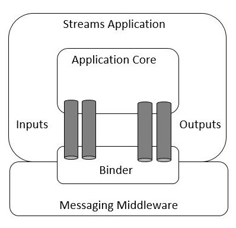
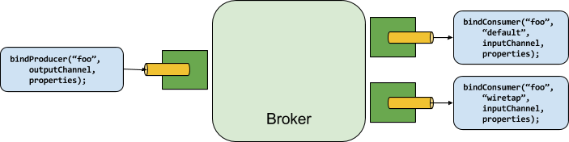

# Steeltoe Stream Reference

This section explores the components that make up the Steeltoe Stream framework together with how to build Stream-based applications.

## Main Concepts

Steeltoe Stream provides a number of abstractions and opinions that simplify the writing of message-driven microservice based applications.
This section gives an overview of the following:

* [Application Model](#application-model)
* [Binder Abstraction](#binder-abstraction)
* [Binding Abstraction](#binding-abstraction)
* [Persistent Publish-Subscribe](#persistent-publish-subscribe)
* [Consumer Types](#consumer-types)
* [Consumer Groups](#consumer-groups)
* [Durability](#durability)
* [Partitioning](#partitioning)
* [Binder SPI](#binder-spi)

### Application Model

A Stream application is composed of middleware-neutral core microservices enhanced by Steeltoe Stream.  Application developers typically do not have to deal with the underlying messaging middleware and instead can focus on the microservice logic itself.
Normally the service communicates with the outside world through input and output channel abstractions injected into it by the Steeltoe Stream infrastructure.  Channels are a programming abstraction that represent messaging destinations. Services can send and receive messages to and from destinations using these channels . Steeltoe Stream automatically configures channels for you and connects them to external messaging systems through middleware-specific binder implementations. Binders are components provided by Steeltoe or other third parties package providers.



### Binder Abstraction

Steeltoe uses a binder abstraction to make it possible for Stream-based services to be flexible in how they connect to messaging middleware.
Steeltoe automatically detects and uses whatever binder it finds in the services startup directory when attempting to connect to the messaging system. This enables developers to use different types of messaging middleware without the need to change the applications code; You simply include a different binder at deployment time.

For more complex use cases, you can package multiple binders with your services and configure it to choose the correct binder for the different channels or destinations used by the service at runtime.
The configuration can be provided through normal .NET configuration providers, including command-line arguments, environment variables, and/or `appsettings.json`.
For example, setting the configuration key `spring:cloud:stream:bindings:input:destination` to `raw-sensor-data` can be used to configure the channel named `input` to be bound to the `raw-sensor-data` RabbitMQ exchange when using a RabbitMQ binder.

Currently, Steeltoe provides a single binder implementation for [Rabbit MQ](https://github.com/spring-cloud/spring-cloud-stream-binder-rabbit). Future binders provided by Steeltoe are on the roadmap including Kafka and others.
You can also use the extensible Binder SPI to write your own should you need to.

### Binding Abstraction

Steeltoe also uses a binding abstraction to provide a way to define the name and types of destinations available to the Stream-based microservice.  Bindings provide a bridge between the destinations in the external messaging system and the methods in the application which act as message producers and/or consumers.

### Persistent Publish-Subscribe

Communication between microservices follow a publish-subscribe model where data is broadcast through shared topics.
This can be seen in the following figure, which shows a typical deployment for a set of interacting Stream microservices.


Data reported by sensors to an HTTP endpoint is sent to a common destination named `raw-sensor-data`.
Receiving data from the destination, the data is independently processed by a microservice based application that computes time-windowed averages and by another microservice that ingests the raw data into HDFS (Hadoop Distributed File System).
In order to process the data, both microservices declare the topic as their input at runtime.

The publish-subscribe communication model reduces the complexity of both the producer and the consumer and lets new services be be easily added to the topology without disruption of the existing flow.
For example, downstream from the average-calculating microservice, you can add an additional service that calculates the highest temperature values for display and monitoring.
Additionally, you can then add another service that interprets the same flow of averages for fault detection.
Doing all communication through shared topics rather than point-to-point queues reduces coupling between microservices.

While the concept of publish-subscribe messaging is not new, Stream takes the extra step of making it an opinionated choice for its application model.
By using native middleware support, Stream also simplifies use of the publish-subscribe model across different platforms.

### Consumer Types

Two types of consumer are supported by the Stream infrastructure:

* Message-driven (sometimes referred to as Asynchronous)
* Polled (sometimes referred to as Synchronous)

The default is to implement message driven consumers, but when you wish to control the rate at which messages are processed, you might want to use a synchronous consumer.  

### Consumer Groups

While the publish-subscribe model makes it easy to connect microservices through shared topics, the ability to scale up by creating multiple instances of a given service is equally important.
When doing so, different instances of a microservice are placed in a competing consumer relationship, where only one of the instances is expected to handle a given message.

Steeltoe Stream models this behavior through the concept of a `consumer group`. Stream consumer groups are similar to and inspired by Kafka consumer groups.
Each consumer binding can configure the `spring:cloud:stream:bindings:<channelName>:group` key to specify a group name.
For the consumers shown in the following figure, this key would be set to `spring:cloud:stream:bindings:<channelName>:group=hdfsWrite` or `spring:cloud:stream:bindings:<channelName>:group=average`.


All groups that subscribe to a given destination receive a copy of published data, but only one member of each group receives a given message from that destination.
By default, when a group is not specified, Stream assigns the application service to an anonymous and independent single-member consumer group that is in a publish-subscribe relationship with all other consumer groups.

### Durability

As part of the opinionated model, Stream consumer group subscriptions are durable.
That is, Binder implementations ensure that group subscriptions are persistent and once a subscription for a group has been created, the group receives messages, even if they are sent while all services in the group have been stopped.

In general, it is preferable to always specify a consumer group when binding a service to a given destination.
When scaling up a Stream service, you must specify a consumer group for each of its input bindings.
Doing so prevents the service instances from receiving duplicate messages unless that behavior is desired, which is not typical.

>Anonymous subscriptions are non-durable by nature. For some Binder implementations (such as RabbitMQ), it is possible to have non-durable group subscriptions as well.

### Partitioning

Stream provides support for partitioning data between multiple instances of a given service.
In a partitioned scenario, the physical communication medium (such as the broker topic) is viewed as being structured into multiple partitions.
One or more producer instances send data to multiple consumer instances and ensure that data identified by common characteristics are processed by the same consumer instance.

Stream provides a common abstraction for implementing partitioned processing use cases in a uniform fashion.
Partitioning can thus be used whether the broker itself is naturally partitioned (for example, Kafka) or not (for example, RabbitMQ).


Partitioning is a critical concept in stateful processing, where it is critical, for either performance or consistency reasons, to ensure that all related data is processed together.
For example, in the time-windowed average calculation example, it is important that all measurements from any given sensor are processed by the same service instance.

>To set up a partitioned processing scenario, you must configure both the data-producing and the data-consuming ends.

## Programming Model

To understand the programming model, you need to understand the following core concepts:

* *Binder:* Component responsible to provide integration with the external messaging systems.
* *Binding:* Bridge between the external messaging system and application service provided producers and consumers.
* *Message:* The canonical data structure used by producers and consumers to communicate with binders, and thus other application services via external messaging systems.


### Binder

As mentioned earlier, binders are an abstraction used by Steeltoe that enables Stream-based application services to integrate with external messaging systems.
This integration includes the responsibility for connectivity, delegation, and routing of messages to and from producers and consumers.  It also includes support for data type conversions,
invocation of the application code responsible for processing messages, and more.  Binders are an infrastructure component provided by Steeltoe or other third party providers.

Binders implement a lot of the boiler-plate code that would otherwise fall on the shoulders of an application developer when communicating with the messaging system. A binder typically requires some form of configuration settings in order to properly function. This detail will be covered in an the upcoming section.

### Bindings

As stated earlier, bindings provide the bridge between the external messaging system and application-provided methods which act as producers and consumers.

You can use the `EnableBinding` attribute in your application to declare bindings for your application or you can use service container extension methods to explicitly add them to the container yourself.

For example the following code shows a fully configured and functioning Stream application service that receives strings from a destination with the name `input` and
and converts the strings to uppercase and then sends the results to a destination with the name `output`.  Notice that the applications `Handle()` method expects the message payload from `input` to be a `string`, and as a result the Stream framework will attempt to convert the incoming message payload to a `string` before calling the handler method (see [Content Type Negotiation](#content-type-negotiation) section).

```csharp
[EnableBinding(typeof(IProcessor))]
public class Program
{
  public static async Task Main(string[] args)
  {
    var host = StreamHost
      .CreateDefaultBuilder<Program>(args)
      .Build();
      await host.StartAsync();
  }

  [StreamListener(IProcessor.INPUT)]
  [SendTo(IProcessor.OUTPUT)]
  public string Handle(string value)
  {
    Console.WriteLine("Received: " + value);
    return value.ToUpper();
  }
}
```

If you examine the `EnableBinding` attribute, you'll see that it takes one or more interface types as parameters. Each interface represents a binding and each method defined in the binding interface represents a bindable (frequently referred to as a destination). Normally, each bindable represents a named message channel when using channel-based binders such as RabbitMQ, Kafka, etc. However, other types of bindings can provide other types of bindables which are intended to support native features of the underlying messaging technology.

Out of the box, Steeltoe provides the three bindings that are commonly used in messaging based services. `ISource`, `ISink`, and `IProcessor` bindings are generic enough that you can use them with many different messaging systems.

* *ISink:* Defines a contract for a message consumer by providing a destination from which messages are consumed.
* *ISource:* Defines the contract for a message producer by providing the destination to which the produced message is sent.
* *IProcessor:* Encapsulates both the `ISink` and the `ISource` contracts by exposing two destinations that allow consumption and production of messages.

The following listing shows the definition of the various interfaces:

```csharp
public interface ISink 
{
  const string INPUT = "input";

  [Input(INPUT)]
  ISubscribableChannel Input { get; }
}

public interface ISource
{
  const string OUTPUT = "output";

  [Output(OUTPUT)]
  IMessageChannel Output { get; }
}

public interface IProcessor : ISource, ISink
{
}
```

Notice in the above the usage of `Input` and `Output` attributes on the property getters.

The `Input` attribute identifies an input channel from which messages received enter the service.  Notice that the constructor argument gives it a name and the type of channel is defined by the return type of the getter (`ISubscribableChannel`).
The `Output` attribute identifies an output channel, through which messages are published. Again, notice the constructor argument gives it a name and the type of channel is defined by the return type of the getter (`ISubscribableChannel`).
As you can see, both the `Input` and `Output` attributes optionally take a `channel name` as a constructor parameter.  If a name is not provided, the name of the annotated method is used as the channel name.

Steeltoe Stream automatically creates an implementation of the interface for you upon start up and makes it available in the service container.
While not a common use case, you can use this in the application service by adding it as a constructor argument to a service you have written. This will give you access to the channel directly via the property getter.  This is not a common way of accessing the channel as Steeltoe provides a much easier programming model which is normally used.

While the out-of-the-box bindings satisfy the majority of use cases, you can also create your own contracts by defining your own binding interfaces with the `Input` and `Output` attributes identifying the actual bindables.

For example:

```csharp
public interface IBarista
 {
  [Input]
  ISubscribableChannel Orders { get; }

  [Output]
  IMessageChannel HotDrinks { get; }

  [Output]
  IMessageChannel ColdDrinks { get; }
}
```

Using the interface shown in the preceding example as a parameter to `EnableBinding` triggers the creation of the three bound channels named `Orders`, `HotDrinks`, and `ColdDrinks`,
respectively.

You can provide as many binding interfaces as you need as arguments to the `EnableBinding` annotation:

```csharp
[EnableBinding(typeof(IOrders), typeof(IPayment))]
public class Program {
{
  static async Task Main(string[] args)
  {
    var host = StreamHost
      .CreateDefaultBuilder<Program>(args)
      .Build();
      await host.StartAsync();
  }
}
```

Notice in the above examples the return type of the individual bindables (e.g. interface properties). The bindable return type `IMessageChannel` is a channel component provided as part of the Steeltoe Messaging infrastructure for interfacing with outbound destinations.  The `ISubscribableChannel` is also provided by Steeltoe Messaging and is used for inbound message reception.

The above bindings support event-based message consumption but sometimes you need more control of the interactions with the messaging infrastructure(e.g. rate of consumption). So instead of using a `ISubscribableChannel` channel, you can instead use a pollable message source, `IPollableMessageSource`.

The following example shows how to define a pollable binding.

```csharp
public interface IPolledBarista {

  [Input]
  IPollableMessageSource Orders { get; }
}
```

In this case, an implementation of `IPollableMessageSource` is bound to the channel with the name `Orders`. See [Using Polled Consumers](#polled-consumers) for more details.

As mentioned earlier the `Input` and `Output` attributes allow you to specify a customized channel name for the channel, as shown in the following example:

```csharp
public interface IBarista 
{
  [Input("InboundOrders")]
  ISubscribableChannel Orders { get; }
}
```

In the above example the created channel is named `InboundOrders`.

Normally, you do not need to access the individual channels or bindings directly, however there may be times (such as testing or other corner cases) when you do.

Aside from generating channels for each binding and registering them as services in the container, Steeltoe Stream also generates a service that implements the interface.
That means you can have access to the interfaces representing the bindings or individual channels by injecting the binding interface into your application component.

### Producing and Consuming Messages

The easiest way to write a a Steeltoe Stream application service is by using Steeltoe Stream attributes.

#### StreamListener Attribute

Steeltoe Stream provides a `StreamListener` attribute, modeled after other Steeltoe Messaging annotations (e.g. `RabbitListener`, and others) and supports features such as content-based routing and others.

```csharp
     static async Task Main(string[] args)
        {
            var host = StreamHost
              .CreateDefaultBuilder<VoteHandler>(args)
              .ConfigureServices(svc=> svc.AddSingleton<IVotingService, DefaultVotingService>())
              .Build();
            await host.StartAsync();
        }

        [EnableBinding(typeof(ISink))]
        public class VoteHandler
        {
            private readonly IVotingService votingService;
            public VoteHandler(IVotingService service)
            {
                votingService = service;
            }

            [StreamListener(ISink.INPUT)]
            public void Handle(Vote vote)
            {
                votingService.Record(vote);
            }
        }
```

As with other Steeltoe Messaging methods, method arguments can be annotated with `Payload`, `Headers`, and `Header` to enable access to additional content from the underlying message.

For methods that return data, you must use the `SendTo` attribute to specify the output destination for data returned by the method, as shown in the following example:

```csharp
    public class Program
    {
        static async Task Main(string[] args)
        {
            var host = StreamHost
              .CreateDefaultBuilder<TransformProcessor>(args)
              .ConfigureServices(svc=> svc.AddSingleton<IVotingService, DefaultVotingService>())
              .Build();
            await host.StartAsync();
        }

        [EnableBinding(typeof(IProcessor))]
        public class TransformProcessor
        {
            private readonly IVotingService votingService;
            public TransformProcessor(IVotingService service)
            {
                votingService = service;
            }

            [StreamListener(IProcessor.INPUT)]
            [SendTo(IProcessor.OUTPUT)]
            public VoteResult Handle(Vote vote)
            {
                return votingService.Record(vote);
            }
        }
    }
```

#### StreamListener and Content-based Routing

Steeltoe Stream supports dispatching messages to multiple handler methods annotated with `StreamListener` based on conditions.

In order to be eligible to support conditional dispatching, the annotated method must not return a value;

The condition is specified using an expression in the `Condition` argument of the annotation and is evaluated for each message.
All the handlers that match the condition are invoked in the same thread, and no assumption should be made about the order in which the invocations take place.

In the following example of a `StreamListener` with dispatching conditions, all the messages bearing a header with the key `type` equal to the value `bogey` are dispatched to the
`ReceiveBogey` method, and all the messages bearing a header `type` with the value `bacall` are dispatched to the `ReceiveBacall` method.

```csharp
    public class Program
    {
        static async Task Main(string[] args)
        {
            var host = StreamHost
              .CreateDefaultBuilder<CatsAndDogs>(args)
              .Build();
            await host.StartAsync();
        }

        [EnableBinding(typeof(IProcessor))]
        public class CatsAndDogs
        {
         
            [StreamListener(ISink.INPUT, "Headers['type']=='Dog'")]
            public void Handle(Dog dog)
            {
                Console.WriteLine("Dog says:"+ dog.Bark);
            }

            [StreamListener(ISink.INPUT, "Headers['type']=='Cat'")]
            public void Handle(Cat cat)
            {
                Console.WriteLine("Cat says:" +cat.Meow);
            }
        }
    }
```

It is important to understand some of the mechanics behind content-based routing using the `Condition` property of `StreamListener`, especially in the context of the type of the message as a whole.
It may also help if you familiarize yourself with the [Content Type Negotiation](#content-type-negotiation) before you proceed.

Consider the following example:

The code below is perfectly valid. It compiles and deploys without any issues, yet it never produces the result you expect.

```csharp
public class Program 
{
  static async Task Main(string[] args)
  {
    var host = StreamHost
      .CreateDefaultBuilder<CatsAndDogs>(args)
      .Build();
      await host.StartAsync();
  }
}

[EnableBinding(typeof(IProcessor))]
public class CatsAndDogs
 {

    [StreamListener(Target = Sink.INPUT, Condition = "Payload.GetType().Name=='Dog'")]
    public void Bark(Dog dog) 
    {
       // handle the message
    }

    [StreamListener(Target = Sink.INPUT, Condition = "Payload.GetType().Name=='Cat'")]
    public void Purr(Cat cat) 
    {
       // handle the message
    }
}
```

 The intent of the expression in the `Condition` is to reference in the incoming `Payload` from the message and access the `Type` of the object returned and then route based on whether the objects type is a `Dog` or a `Cat`.

The reason this does not work is because at this point the expression is testing something that does not yet exist in the message that is being processed. At this point in processing of an incoming message the payload has not yet been converted from the
wire format, typically a `byte[]`, to the desired type exposed in the methods signature.  In other words, it has not yet gone through the type conversion process described in the [Content Type Negotiation](#content-type-negotiation).
<!--
>At the moment, dispatching through `StreamListener` conditions is supported only for channel-based binders.  // TODO: Is this correct?????


  TODO: Keep this as we might need this when we support a functional approach to streams

#### <a name="spring_cloud_function"></a>Spring Cloud Function support

Since Spring Cloud Stream v2.1, another alternative for defining _stream handlers_ and _sources_ is to use build-in
support for [Spring Cloud Function](https://cloud.spring.io/spring-cloud-function/) where they can be expressed as beans of
 type `java.util.function.[Supplier/Function/Consumer]`.

To specify which functional bean to bind to the external destination(s) exposed by the bindings, you must provide `spring.cloud.stream.function.definition` property.

Here is the example of the Processor application exposing message handler as `java.util.function.Function`
```java
@SpringBootApplication
@EnableBinding(Processor.class)
public class MyFunctionBootApp {

	public static void main(String[] args) {
		SpringApplication.run(MyFunctionBootApp.class, "--spring.cloud.stream.function.definition=toUpperCase");
	}

	@Bean
	public Function<String, String> toUpperCase() {
		return s -> s.toUpperCase();
	}
}
```
In the above you we simply define a bean of type `java.util.function.Function` called _toUpperCase_ and identify it as a bean to be used as message handler
whose 'input' and 'output' must be bound to the external destinations exposed by the Processor binding.

Below are the examples of simple functional applications to support Source, Processor and Sink.

Here is the example of a Source application defined as `java.util.function.Supplier`
```java
@SpringBootApplication
@EnableBinding(Source.class)
public static class SourceFromSupplier {
	public static void main(String[] args) {
		SpringApplication.run(SourceFromSupplier.class, "--spring.cloud.stream.function.definition=date");
	}
	@Bean
	public Supplier<Date> date() {
		return () -> new Date(12345L);
	}
}
```

Here is the example of a Processor application defined as `java.util.function.Function`
```java
@SpringBootApplication
@EnableBinding(Processor.class)
public static class ProcessorFromFunction {
	public static void main(String[] args) {
		SpringApplication.run(ProcessorFromFunction.class, "--spring.cloud.stream.function.definition=toUpperCase");
	}
	@Bean
	public Function<String, String> toUpperCase() {
		return s -> s.toUpperCase();
	}
}
```

Here is the example of a Sink application defined as `java.util.function.Consumer`
```java
@EnableAutoConfiguration
@EnableBinding(Sink.class)
public static class SinkFromConsumer {
	public static void main(String[] args) {
		SpringApplication.run(SinkFromConsumer.class, "--spring.cloud.stream.function.definition=sink");
	}
	@Bean
	public Consumer<String> sink() {
		return System.out::println;
	}
}
```

##### Reactive Functions support

Since _Spring Cloud Function_ is build on top of [Project Reactor](https://projectreactor.io/) there isn't much you need to do
to benefit from reactive programming model while implementing `Supplier`, `Function` or `Consumer`.

For example:

```java
@EnableAutoConfiguration
@EnableBinding(Processor.class)
public static class SinkFromConsumer {
	public static void main(String[] args) {
		SpringApplication.run(SinkFromConsumer.class, "--spring.cloud.stream.function.definition=reactiveUpperCase");
	}
	@Bean
	public Function<Flux<String>, Flux<String>> reactiveUpperCase() {
		return flux -> flux.map(val -> val.toUpperCase());
	}
}
```
##### Functional Composition

Using this programming model you can also benefit from functional composition where you can dynamically compose complex handlers from a set of simple functions.
As an example let's add the following function bean to the application defined above
```java
@Bean
public Function<String, String> wrapInQuotes() {
	return s -> "\"" + s + "\"";
}
```
and modify the `spring.cloud.stream.function.definition` property to reflect your intention to compose a new function from both ‘toUpperCase’ and ‘wrapInQuotes’.
To do that Spring Cloud Function allows you to use `|` (pipe) symbol. So to finish our example our property will now look like this:

```java
--spring.cloud.stream.function.definition=toUpperCase|wrapInQuotes
```

NOTE: One of the great benefits of functional composition support provided by _Spring Cloud Function_ is
the fact that you can compose _reactive_ and _imperative_ functions.

For example, the above composition could be defined as such (if both functions present):

```java
--spring.cloud.stream.function.definition=reactiveUpperCase|wrapInQuotes
```
-->

#### Polled Consumers

When implementing polled consumers, you are required to poll the `IPollableMessageSource` on demand.
Consider the following example of a polled consumer:

```csharp

public interface IPolledConsumerBinding
{
    [Input]
    IPollableMessageSource DestIn { get; }

    [Output]
    IMessageChannel DestOut { get; }
}

[EnableBinding(typeof(IPolledConsumerBinding))]
public class Program
{
    static async Task Main(string[] args)
    {
        var host = StreamHost
          .CreateDefaultBuilder<Program>(args)
          .ConfigureServices(svc => svc.AddHostedService<Worker>())
          .Build();
        await host.StartAsync();
    }
}

```

Given the polled consumer in the preceding example, you might use it as follows:

```csharp
  public class Worker : BackgroundService, IMessageHandler
    {
        private readonly IPolledConsumerBinding _binding;
        private readonly ILogger<Worker> _logger;

        public string ServiceName { get; set; } = "BackgroundWorker";

        public Worker(IPolledConsumerBinding binding, ILogger<Worker> logger)
        {
            _binding = binding;
            _logger = logger;
        }

        protected override async Task ExecuteAsync(CancellationToken stoppingToken)
        {
            await Task.Delay(5000, stoppingToken); // Wait for setup on first poll 
            while (!stoppingToken.IsCancellationRequested)
            {
                _logger.LogInformation("Worker running at: {time}", DateTimeOffset.Now);
                try
                {
                    if (!_binding.DestIn.Poll(this))
                    {
                        await Task.Delay(2000, stoppingToken);
                    }
                }
                catch (Exception e)
                {
                    _logger.LogError(e, e.Message);
                }
            }
        }

        public void HandleMessage(IMessage message)
        {
            try
            {
                var payloadString = (string)message.Payload;
                var newPayload = payloadString.ToUpper();
                _logger.LogInformation("Received Message : " + payloadString);
                _binding.DestOut.Send(Message.Create(newPayload));
                _logger.LogInformation("Sent Message : " + newPayload);

            }
            catch (Exception e)
            {
                _logger.LogError(e, e.Message);
            }
        }
    }
```

The `IPollableMessageSource.Poll()` method takes a `IMessageHandler` argument. It returns `True` if a message was received and successfully processed.

As with message-driven consumers, if the `IMessageHandler` throws an exception, messages are published to error channels, as discussed in [Error Handling](#error-handling).

Normally, the `Poll()` method acknowledges the message when the `IMessageHandler` exits. If the method exits abnormally, the message is rejected and not re-queued, but see [Handling Errors](#error-handling) for more options.
You can override that behavior by taking responsibility for the acknowledgment, as shown in the following example:

```csharp
public void HandleMessage(IMessage message)
{
  try 
  {
    StaticMessageHeaderAccessor.GetAcknowledgmentCallback(message).IsAutoAck = False;
    // e.g. hand off to another thread which can perform the ack or Acknowledge(Status.REQUEUE)
  } 
  catch (Exception e)
  {
    // handle failure
  }
}
```

>IMPORTANT: You must `ack` (or `nack`) the message at some point, to avoid resource leaks.

>IMPORTANT: Some messaging systems maintain a simple offset in a log. If a delivery fails and is re-queued with  `StaticMessageHeaderAccessor.GetAcknowledgmentCallback(m).Acknowledge(Status.REQUEUE);`, any later successfully ack'd messages are redelivered.

There is also an overloaded `Poll` method which allows you to provide a conversion hint:

```csharp
Poll(IMessageHandler handler, Type type)
```

The `type` is a conversion hint that allows the incoming message payload to be converted, as shown in the following example:

```csharp
....
protected override async Task ExecuteAsync(CancellationToken stoppingToken)
{
  while (!stoppingToken.IsCancellationRequested)
  {
      _logger.LogInformation("Worker running at: {time}", DateTimeOffset.Now);
      try 
      {
        if (!_binding.DestIn.Poll(this), typeof(Dictionary<string, Foo>))
        {
          await Task.Delay(1000, stoppingToken);
        }
      }
      catch (Exception e)
      {
        // handle failure
      }
  }
}

public void HandleMessage(IMessage message)
{
  try 
  {
    var payload = ((Dictionary<string, Foo>) message.Payload);
    ....
  } 
  catch (Exception e)
  {
    // handle failure
  }
}
```

By default, an error channel is configured for the pollable source. If the callback throws an exception an `ErrorMessage` is sent to the error channel with the name(`<destination>.<group>.errors`).

You can subscribe to the error channel with a `ServiceActivator` attribute to receive and process the `ErrorMessage`. Without a subscription, the error will simply be logged and the message will be acknowledged as successful.
If the error channel service activator throws an exception, the message will be rejected (by default) and won't be redelivered.
If the service activator throws a `RequeueCurrentMessageException`, the message will be requeued at the broker and will be again retrieved on a subsequent poll.

If the handler throws a `RequeueCurrentMessageException` directly, the message will be requeued, as discussed above, and will not be sent to the error channel.

### Error Handling

Errors happen and Steeltoe Stream provides several flexible mechanisms to handle them.
The error handling comes in two flavors:

* *application:* The error handling is done within the application service using a custom error handler.
* *system:* The error handling is delegated to the binder to handle by re-queueing, or using a DL queue or via some other means. Note that the techniques are dependent on binder implementation and the capability of the underlying messaging middleware.

#### Application Error Handling

There are two types of application-level error handling. Errors can be handled at each binding subscription or by a global handler which handles all the binding errors. Below are the details.

   

For each input binding, Steeltoe Stream creates a dedicated error channel with the following name `<destinationName>.errors`.

>The `<destinationName>` consists of the name of the binding bindable name (e.g. `input`) and the name of the group (e.g. `myGroup`).

Consider the following:

```
spring:cloud:stream:bindings:input:group=myGroup
```

```csharp
[StreamListener(ISink.INPUT)]      // destination name 'input.myGroup'
public void Handle(Person value) 
{
    throw new Exception("BOOM!");
}

[ServiceActivator(IProcessor.INPUT + ".myGroup.errors")]     //channel name 'input.myGroup.errors'
public void Error(IMessage message) 
{
    Console.WriteLine("Handling ERROR: " + message);
}
```

In the preceding example the destination name is `input.myGroup` and the dedicated error channel name is `input.myGroup.errors`.

>NOTE: The use of `StreamListener` annotation is intended specifically to define bindings that bridge internal channels and external destinations. The
`ServiceActivator` annotation is used to reference internally created channels.

>NOTE: If `group` is not specified, an anonymous group is used instead (e.g. `input.anonymous.2K37rb06Q6m2r51-SPIDDQ`). This is obviously not suitable for error
handling scenarios, since you don't know what the name is going to be until the destination is created.

If you have multiple bindings, you may want to have a single error handler for all of them. Steeltoe Stream automatically provides support for
a _global error channel_ by bridging each individual error channel to the channel named `errorChannel`, allowing a single subscriber to handle all errors as shown in the following example:

```csharp
[ServiceActivator("errorChannel")]
public void Error(IMessage message) 
{
    Console.WriteLine("Handling ERROR: " + message);
}
```

This may be a convenient option if error handling logic is the same regardless of which handler produced the error.

#### System Error Handling

System-level error handling implies that the errors are communicated back to the messaging system and given that not every messaging system is the same, the capabilities may differ from binder to binder.

That said, in this section we explain the general idea behind system level error handling and using the RabbitMQ binder as an example.  For more details and configuration options, see the individual binder's documentation.

If no internal error handlers are configured, the errors propagate to the binders, and the binders subsequently propagate those errors back to the messaging system.
Depending on the capabilities of the messaging system, some may _drop_ the message, _re-queue_ the message for re-processing or _send the failed message to Dead Letter Queue (DLQ).
The RabbitMQ binder support these concepts. However, other binders may not, so refer to your individual binder’s documentation for details on supported system-level
error-handling options.

##### Drop Failed Messages

By default, if no additional system-level configuration is provided, the messaging system drops the failed message.
While acceptable in some cases, for most cases, it is not, and we need some recovery mechanism to avoid message loss.

##### Dead Letter Queue (DLQ)

DLQ allows failed messages to be sent to a special destination: - _Dead Letter Queue_.

When configured, failed messages are sent to this destination for subsequent re-processing or auditing and/or reconciliation.

For example, continuing on the previous example and to set up the DLQ with RabbitMQ binder, you need to set the following configuration setting:

```
spring:cloud:stream:rabbit:bindings:input:consumer:autoBindDlq=True
```

Keep in mind that, in the above setting, `input` corresponds to the name of the input destination binding.
The `consumer` indicates that it is a consumer property and `autoBindDlq` instructs the binder to configure the DLQ for the `input` destination, which results in an additional Rabbit queue named `input.myGroup.dlq`.

Once configured, all failed messages are routed to this queue with an error message similar to the following:

```yaml
delivery_mode: 1
headers:
x-death:
count: 1
reason: rejected
queue: input.hello
time: 1522328151
exchange:
routing-keys: input.myGroup
Payload {"name”:"Bob"}
```

As you can see from the above, your original message is preserved for further actions.

However, one thing you may have noticed is that there is limited information on the original issue with the message processing. For example, you do not see a stack trace corresponding to the original error.
To get more relevant information about the original error, you must set an additional configuration setting:

```
spring:cloud:stream:rabbit:bindings:input:consumer:republishToDlq=True
```

Doing so forces the internal error handler to intercept the error message and add additional information to it before publishing it to DLQ.
Once configured, you can see that the error message contains more information relevant to the original error, as follows:

```yaml
delivery_mode: 2
headers:
x-original-exchange:
x-exception-message: has an error
x-original-routingKey: input.myGroup
x-exception-stacktrace: <The stack trace captured during the error>
Payload {"name”:"Bob"}
```

This effectively combines application-level and system-level error handling to further assist with downstream troubleshooting mechanics.

##### Re-queue Failed Messages

Currently supported binders rely on an internal class called a `RetryTemplate` to facilitate successful message processing. The template is configurable and will attempt to deliver messages to the consumer/handler and retry up to a max number of attempts if not successful. See the section which follow for configuration parameters. However, for cases when the `maxAttempts` configuration setting is set to 1, internal reprocessing of the message is disabled. To facilitate message re-processing (re-tries) under this condition you can instead
instruct the messaging system to re-queue the failed message to be reprocessed. Once re-queued, the failed message is sent back to the original handler, essentially creating a retry loop.

This configuration option may be feasible for cases where the nature of the error is related to some sporadic yet short-term unavailability of some resource.

To accomplish that, you must set the following configuration settings:

```
spring:cloud:stream:bindings:input:consumer:maxAttempts=1
spring:cloud:stream:rabbit:bindings:input:consumer:requeueRejected=True
```

With these settings the failed message is resubmitted to the same handler and loops continuously or until the handler throws `RabbitRejectAndDontRequeueException`
essentially allowing you to build your own re-try logic within the handler itself.

#### Retry Template

The `RetryTemplate` is part of the Steeltoe library and is used internally for various purposes.
While it is out of scope of this document to cover all of the capabilities of the `RetryTemplate`, we will mention the following consumer properties that are specifically related to
the `RetryTemplate`:

**maxAttempts**
The number of attempts to process the message.

  Default: 3.

**backOffInitialInterval**
  The back-off initial interval on retry.

  Default 1000 milliseconds.

**backOffMaxInterval**
  The maximum back-off interval.

  Default 10000 milliseconds.

**backOffMultiplier**
  The back-off multiplier.

  Default 2.0.

**defaultRetryable**
  Whether exceptions thrown by the consumer that are not listed in the `retryableExceptions` are retryable.

  Default: `True`.

**retryableExceptions**
  A list of Exception class names.
  Specify those exceptions (and subclasses) that will be retried.
  Also see `defaultRetryable`.

  Default: empty.

## Binders

Steeltoe Stream provides a Binder abstraction for use in connecting to physical destinations at the external middleware.  This section provides information about the main concepts behind the Binder SPI, its main components, and implementation-specific details. This section is relevant to those developers who might be considering developing a binder for a specific messaging platform.

### Producers and Consumers

The following image shows the general relationship of producers and consumers:



A producer is any component that sends messages to a channel.
The channel can be bound to an external message broker with a binder implementation for that broker.
When invoking the `BindProducer()` method, the first parameter is the name of the destination within the broker, the second parameter is the local channel instance to which the producer sends messages, and the third parameter contains properties (such as a partition key expression) to be used within the adapter that is created for that channel.

A consumer is any component that receives messages from a channel.
As with a producer, the consumer's channel can be bound to an external message broker.
When invoking the `BindConsumer()` method, the first parameter is the destination name, and a second parameter provides the name of a logical group of consumers.
Each group that is represented by consumer bindings for a given destination receives a copy of each message that a producer sends to that destination (that is, it follows normal publish-subscribe semantics).
If there are multiple consumer instances bound with the same group name, then messages are load-balanced across those consumer instances so that each message sent by a producer is consumed by only a single consumer instance within each group (that is, it follows normal queueing semantics).

### Binder SPI

The Binder SPI consists of a number of interfaces, out-of-the box utility classes, and discovery strategies that provide a pluggable mechanism for connecting to external middleware.

The key point of the SPI is the `IBinder` interface(s), which is a strategy for connecting inputs and outputs to external middleware. The following listing shows the definition of the `IBinder` interface:

```csharp
public interface IBinder : IServiceNameAware 
{
    Type TargetType { get; }
    IBinding BindConsumer(string name, string group, object inboundTarget, IConsumerOptions consumerOptions);
    IBinding BindProducer(string name, object outboundTarget, IProducerOptions producerOptions);
}
public interface IBinder<in T> : IBinder
{
    IBinding BindConsumer(string name, string group, T inboundTarget, IConsumerOptions consumerOptions);
    IBinding BindProducer(string name, T outboundTarget, IProducerOptions producerOptions);
}
```

The interface is parameterized, offering a number of extension points:

* Input and output bind targets. Typically an `IMessageChannel` is supported, but this is intended to be used as an extension point in the future.
* Consumer and producer options, allowing specific Binder implementations to add supplemental properties that can be supported in a type-safe manner.

A typical binder implementation consists of the following:

* A class that implements the `IBinder<T>` interface;
* A assembly level `BinderAttribute` defining the name of the binder and the System.Type that will be used to configure the binder upon startup.
* A startup class which has contains a constructor that takes an `IConfiguration` as an argument and a method with the name`ConfigureServices()` and takes a single argument `IServiceCollection`.

Here is an example of the 'startup class'

```csharp
[assembly: Binder("testbinder", typeof(Startup))]

public class Startup
{
  public Startup(IConfiguration configuration)
  {
      Configuration = configuration;
  }

  public IConfiguration Configuration { get; }

  // This method gets called by the runtime. Use this method to configure the service container for the binder
  public void ConfigureServices(IServiceCollection services)
  {
    ....
  }
}
  ```

### Binder Detection

The Steeltoe Stream infrastructure relies on implementations of the Binder SPI to perform the task of connecting channels to message brokers.
Each Binder implementation typically connects to one type of messaging system.

By default, the Stream infrastructure will auto-configure the binder by searching for the assembly `BinderAttribute` in each assembly located in the directory from which the application is started.
If a single Binder implementation is found, Steeltoe Stream automatically uses it and configures it using the `ConfigureServices()` method illustrated above.
For example, a Stream project that aims to bind only to RabbitMQ can add the following dependency to the project.

```xml
    <PackageReference Include="Steeltoe.Stream.Binder.RabbitMQ" Version="3.1.0" />
```

### Multiple Binders

When multiple binders are discovered, the application must indicate which binder is to be used for each channel binding.
Each assembly `BinderAttribute` discovered contains the name of the binder that should be used when configuring channel bindings.

Binder selection can either be performed globally, using the `spring:cloud:stream:defaultBinder` configuration key (for example, `spring:cloud:stream:defaultBinder=rabbit`) or individually, by configuring the binder on each channel binding.
For instance, an application that has channels named `input` and `output` for read and write operations and needs to read from a binder with name `foo` and write to RabbitMQ can specify the following configuration:

```
spring:cloud:stream:bindings:input:binder=foo
spring:cloud:stream:bindings:output:binder=rabbit
```

<!-- Test before RC2
### Connecting to Multiple Systems // TODO Check this

By default, binders share the application's service container so only one instance of a binder is created.
If your application should need to connect to more than one broker of the same type, you can specify multiple binder configurations, each with different settings.

NOTE: Turning on explicit binder configuration disables the default binder configuration process altogether.
If you do so, all binders in use must be included in the configuration.
Frameworks that intend to use Spring Cloud Stream transparently may create binder configurations that can be referenced by name, but they do not affect the default binder configuration.
In order to do so, a binder configuration may have its `defaultCandidate` flag set to False (for example, `spring.cloud.stream.binders.<configurationName>.defaultCandidate=False`).
This denotes a configuration that exists independently of the default binder configuration process.

The following example shows a typical configuration for a processor application that connects to two RabbitMQ broker instances:

```json
{
"spring": {
  "cloud": {
    "stream": {
      "bindings": {
        "input": {
          "destination": "thing1",
          "binder": "rabbit1"
        },
        "output": {
          "destination": "thing2",
          "binder": "rabbit2"
        }
      },
      "binders": {
        "rabbit1": {
          "type": "rabbit",
          "environment": {
            "spring": {
              "rabbit": {
                "host": "<host1>"
              }
            }
          }
        },
        "rabbit2" : {
          "type": "rabbit",
          "environment": {
            "spring" : {
              "rabbit": {
                "host": "<host2>"
              }
            }
          }
        }
      }
      }
    }
  }
}
``` -->

### Binder Configuration

The following settings are available when customizing binder configurations. These settings can be obtained by binding an `IConfiguration` to `Steeltoe.Stream.Config.BinderOptions`

They must be prefixed with `spring:cloud:stream:binders.<binderName>`.

**type**
The binder type. It typically references one of the binders found during discovery of the assembly `BinderAttribute` attributes.

  By default, it has the same value as the configuration name.

**inheritEnvironment**
Whether the configuration inherits the environment of the application itself.

  Default: `True`.

**environment**
  Root for a set of properties that can be used to customize the environment of the binder.
  When this property is set, the configuration in which the binder is being created is not a the application configuration.
  This setting allows for complete separation between the binder components and the application components.

  Default: `empty`.

**defaultCandidate**
Whether the binder is a candidate for being considered a default binder or can be used only when explicitly referenced.
This setting allows adding a binder without interfering with the default processing.

  Default: `True`.

## Configuration Settings

Steeltoe Stream supports general configuration settings as well as configuration for bindings and binders.
Some binders let additional binding properties support middleware-specific features.

Configuration settings can be provided to Stream applications through any mechanism supported by .NET.
This includes application arguments, environment variables, and JSON files.

### Binding Service Settings

 These settings can be obtained by binding an `IConfiguration` to  `Steeltoe.Stream.Config.BindingServiceOptions`.  All settings should be prefixed with `spring:cloud:stream`.

**instanceCount**
The expected number of deployed instances of an application.
Must be set for partitioning on the producer side. Must be set on the consumer side when using RabbitMQ and if `autoRebalanceEnabled=False`.

  Default: `1`.

**instanceIndex**
The instance index of the application: A number from `0` to `instanceCount - 1`.
Used for partitioning with RabbitMQ if `autoRebalanceEnabled=False`.
Automatically set in TAS to match the application's instance index.

**dynamicDestinations**
A list of destinations that can be bound dynamically (for example, in a dynamic routing scenarios).
If set, only listed destinations can be bound.

  Default: empty (letting any destination be bound).

**defaultBinder**
The default binder to use, if multiple binders are discovered.
See [Multiple Binders](#multiple-binders).

  Default: empty.

**overrideCloudConnectors**
If the setting is `False` (the default), the binder detects a suitable bound service (for example, a RabbitMQ service bound in Cloud Foundry for the RabbitMQ binder) and uses it for creating connections (usually through Steeltoe Connectors).
When set to `True`, this setting instructs binders to completely ignore the bound services and rely on applications configuration (for example, relying on the `spring:rabbitmq.*` properties provided in the configuration for the RabbitMQ binder).
The typical usage of this setting is to be nested in a customized environment.
 <!-- [Connecting to Multiple Systems](#multiple-systems). -->

  Default: `False`.

**bindingRetryInterval**
The interval (in seconds) between retrying binding creation when, for example, the binder does not support late binding and the broker is down.
Set it to zero to treat such conditions as fatal, preventing the application from starting.

  Default: `30`

### Binding Settings

Binding settings are supplied by using the format of `spring:cloud:stream:bindings:<channelName>:<setting>=<value>`.
The `<channelName>` represents the name of the channel being configured (for example, `output` for a `Source`).

To avoid repetition, Stream supports setting values for all channels, in the format of `spring:cloud:stream:default:<setting>=<value>` for common binding properties, and `spring:cloud:stream:default:<producer|consumer>.<setting>=<value>`.

When it comes to avoiding repetitions for extended binding properties, this format should be used - `spring:cloud:stream:<binder-type>:default:<producer|consumer>.<setting>=<value>`.

In what follows, we indicate where we have omitted the `spring:cloud:stream:bindings:<channelName>.` prefix and focus just on the setting name, with the understanding that the prefix ise included at runtime.

#### Common Binding Settings

 These settings can be obtained by binding an `IConfiguration` to  `Steeltoe.Stream.Config.BindingOptions`.

The following binding settings are available for both input and output bindings and must be prefixed with `spring:cloud:stream:bindings:<channelName>.` (for example, `spring:cloud:stream:bindings:input:destination=ticktock`).

Default values can be set by using the `spring:cloud:stream:default` prefix (for example`spring:cloud:stream:default:contentType=application/json`).

**destination**
The target destination of a channel on the bound middleware (for example, the RabbitMQ exchange).
If the channel is bound as a consumer, it could be bound to multiple destinations, and the destination names can be specified as comma-separated `string` values.
If not set, the channel name is used instead.
The default value of this property cannot be overridden.

**group**
The consumer group of the channel.
Applies only to inbound bindings.
See [Consumer Groups](#consumer-groups).

  Default: `null` (indicating an anonymous consumer).

**contentType**
The content type of the channel.
See [Content Type Negotiation](#content-type-negotiation).

  Default: `application/json`.

**binder**
The binder used by this binding.
See [Multiple Binders](#multiple-binders) for details.

  Default: `null` (the default binder is used, if it exists).

#### Consumer Settings

These settings can be obtained by binding an `IConfiguration` to  `Steeltoe.Stream.Config.ConsumerOptions`.

The following binding settings are available for input bindings only and must be prefixed with `spring:cloud:stream:bindings:<channelName>.consumer.` (for example, `spring:cloud:stream:bindings:input:consumer:concurrency=3`).

Default values can be set by using the `spring:cloud:stream:default:consumer` prefix (for example, `spring:cloud:stream:default:consumer:headerMode=none`).

**autoStartup**
Signals if this consumer needs to be started automatically

  Default: `True`.

**concurrency**
The concurrency of the inbound consumer.

  Default: `1`.

**partitioned**
Whether the consumer receives data from a partitioned producer.

  Default: `False`.

**headerMode**
When set to `None`, disables header parsing on input.
Effective only for messaging middleware that does not support message headers natively and requires header embedding.
This option is useful when consuming data from non-Stream applications when native headers are not supported.
When set to `Headers`, it uses the middleware's native header mechanism.
When set to `EmbeddedHeaders`, it embeds headers into the message payload.

  Default: depends on the binder implementation.

**maxAttempts**
If processing fails, the number of attempts to process the message (including the first).
Set to `1` to disable retry.

  Default: `3`.

**backOffInitialInterval**
The back-off initial interval on retry.

  Default: `1000`.

**backOffMaxInterval**
The maximum back-off interval.

  Default: `10000`.
**backOffMultiplier**
The back-off multiplier.

  Default: `2.0`.

**defaultRetryable**
Whether exceptions thrown by the listener that are not listed in the `retryableExceptions` are retryable.

  Default: `True`.

**instanceIndex**
When set to a value greater than equal to zero, it allows customizing the instance index of this consumer (if different from `spring:cloud:stream:instanceIndex`).
When set to a negative value, it defaults to `spring:cloud:stream:instanceIndex`.
<!-- See [Instance Index and Instance Count](#instance-index-and-instance-count) for more information. -->

  Default: `-1`.

**instanceCount**
When set to a value greater than equal to zero, it allows customizing the instance count of this consumer (if different from `spring:cloud:stream:instanceCount`).
When set to a negative value, it defaults to `spring:cloud:stream:instanceCount`.
<!-- See [Instance Index and Instance Count](#instance-index-and-instance-count) for more information. -->

  Default: `-1`.

**retryableExceptions**
A comma separated list of Exception class names.
Specify those exceptions (and subclasses) that will be retried.
Also see `defaultRetryable`.

  Default: empty.

**useNativeDecoding**
When set to `True`, the inbound message is deserialized directly by the client library, which must be configured correspondingly.
When this configuration is being used, the inbound message unmarshalling is not based on the `contentType` of the binding.
When native decoding is used, it is the responsibility of the producer to use an appropriate encoder  to serialize the outbound message.
Also, when native encoding and decoding is used, the `headerMode=EmbeddedHeaders` setting is ignored and headers are not embedded in the message.
See the producer property `useNativeEncoding`.

  Default: `False`.

#### Advanced Consumer Binding Settings

For advanced configuration of the underlying message listener container for message-driven consumers see the documentation for the binder you expect to use.

#### Producer Settings

These settings can be obtained by binding an `IConfiguration` to  `Steeltoe.Stream.Config.ProducerOptions`.

The following binding settings are available for output bindings only and must be prefixed with `spring:cloud:stream:bindings:<channelName>.producer.` (for example, `spring:cloud:stream:bindings:input:producer:partitionKeyExpression=payload.id`).

Default values can be set by using the prefix `spring:cloud:stream:default:producer` (for example, `spring:cloud:stream:default:producer:partitionKeyExpression=payload.id`).

**autoStartup**
Signals if this consumer needs to be started automatically

  Default: `True`.

**partitionKeyExpression**
An expression that determines how to partition outbound data.
If set, outbound data on this channel is partitioned. `partitionCount` must be set to a value greater than 1 to be effective.
See [Partitioning Support](#partitioning).

  Default: null.

**partitionSelectorExpression**
An expression for customizing partition selection.
If not set, the partition is selected as the `GetHashCode(key) % partitionCount`, where `key` is computed through `partitionKeyExpression`.

  Default: `null`.

**partitionKeyExtractorName**
The name of a .NET type that implements `IPartitionKeyExtractorStrategy`. It will be used to extract a key used to compute
the partition id (see 'partitionSelector*'). Mutually exclusive with 'partitionKeyExpression'.

  Default: null.

**partitionSelectorName**
The name of a .NET type that implements `IPartitionSelectorStrategy`. It will be used to determine partition id based
on partition key (see 'partitionKeyExtractor*'). Mutually exclusive with 'partitionSelectorExpression'.

  Default: null.

**partitionCount**
The number of target partitions for the data, if partitioning is enabled.
Must be set to a value greater than 1 if the producer is partitioned.

  Default: `1`.

**requiredGroups**
A comma-separated list of groups to which the producer must ensure message delivery even if they start after it has been created (for example, by pre-creating durable queues in RabbitMQ).

**headerMode**
When set to `None`, it disables header embedding on output.
It is effective only for messaging middleware that does not support message headers natively and requires header embedding.
This option is useful when producing data for non-Stream applications when native headers are not supported.
When set to `Headers`, it uses the middleware's native header mechanism.
When set to `EmbeddedHeaders`, it embeds headers into the message payload.

  Default: Depends on the binder implementation.

**useNativeEncoding**
When set to `True`, the outbound message is serialized directly by the client library, which must be configured correspondingly.
When this configuration is being used, the outbound message marshalling is not based on the `contentType` of the binding.
When native encoding is used, it is the responsibility of the consumer to use an appropriate decoder to deserialize the inbound message.
Also, when native encoding and decoding is used, the `headerMode=EmbeddedHeaders` setting is ignored and headers are not embedded in the message.
See the consumer setting `useNativeDecoding`.

  Default: `False`.

**errorChannelEnabled**
When set to `True`, if the binder supports asynchronous send results, send failures are sent to an error channel for the destination.
See [Error Handling](#error-handling) for more information.

  Default: `False`.

### Dynamically Bound Destinations  

Besides the channels defined by using `EnableBinding` attribute, Stream lets applications send messages to dynamically bound destinations.
This is useful, for example, when the target destination needs to be determined at runtime.
Applications can do so by using the `BinderAwareChannelResolver` service (which is registered automatically when using `AddStreamServices<T>` extension in the application Host Builder).

The `spring.cloud.stream.dynamicDestinations` setting can be used for restricting the dynamic destination names to a known set (whitelisting).
If this property is not set, any destination can be bound dynamically.

The `BinderAwareChannelResolver` can be used directly, as shown in the following example of a console application receiving messages from an input source and deciding the target channel based on the body of the message (see [Dynamic Destination Sample](https://github.com/SteeltoeOSS/Samples/tree/main/Stream/DynamicDestinationMessaging) for full solution):


Program.cs
```csharp
[EnableBinding(typeof(ISink))]
class Program
{
    private static BinderAwareChannelResolver binderAwareChannelResolver;

    static async Task Main(string[] args)
    {
        var host = StreamHost.CreateDefaultBuilder<Program>(args).Build();

        binderAwareChannelResolver = 
          host.Services.GetService<IDestinationResolver<IMessageChannel>>() as BinderAwareChannelResolver;

        await host.StartAsync();
    }

    [StreamListener(ISink.INPUT)]
    public async void Handle(string incomingMessage)
    {
        var destination = incomingMessage.Contains("URGENT") ? "requests.urgent" : "requests.general";
        var outgoingMessage = Message.Create(Encoding.UTF8.GetBytes(incomingMessage));

        await binderAwareChannelResolver.ResolveDestination(destination).SendAsync(outgoingMessage);
    }
}
```

appsettings.json
```json
{
  "spring": {
    "cloud": {
      "stream": {
        "binder": "rabbit",
        "bindings": {
          "input": {
            "group": "requests",
            "destination": "requests.incoming"
          }
        }
      }
    }
  }
}
```

Now consider what happens when we start the application and make the following requests from the `requests.incoming` exhange within RabbitMQ.
The destinations, 'requests.urgent' and 'requests.general', are created in the broker (in the exchange for RabbitMQ) with names of 'requests.urgent' and 'requests.general', and the data is published to the appropriate destinations.

<!--

// TODO:  Need to verify/test ServiceActivator wiring in context of RabbitMQ binder

The `BinderAwareChannelResolver` is a general-purpose Spring Integration `DestinationResolver` and can be injected in other components -- for example, in a router using a SpEL expression based on the `target` field of an incoming JSON message. The following example includes a router that reads SpEL expressions:

```java
@EnableBinding
@Controller
public class SourceWithDynamicDestination {

    @Autowired
    private BinderAwareChannelResolver resolver;

    @RequestMapping(path = "/", method = POST, consumes = "application/json")
    @ResponseStatus(HttpStatus.ACCEPTED)
    public void handleRequest(@RequestBody String body, @RequestHeader(HttpHeaders.CONTENT_TYPE) Object contentType) {
        sendMessage(body, contentType);
    }

    private void sendMessage(Object body, Object contentType) {
        routerChannel().send(MessageBuilder.createMessage(body,
                new MessageHeaders(Collections.singletonMap(MessageHeaders.CONTENT_TYPE, contentType))));
    }

    @Bean(name = "routerChannel")
    public MessageChannel routerChannel() {
        return new DirectChannel();
    }

    @Bean
    @ServiceActivator(inputChannel = "routerChannel")
    public ExpressionEvaluatingRouter router() {
        ExpressionEvaluatingRouter router =
            new ExpressionEvaluatingRouter(new SpelExpressionParser().parseExpression("payload.target"));
        router.setDefaultOutputChannelName("default-output");
        router.setChannelResolver(resolver);
        return router;
    }
}
```

The [Router Sink Application](https://github.com/spring-cloud-stream-app-starters/router) uses this technique to create the destinations on-demand.

If the channel names are known in advance, you can configure the producer properties as with any other destination.
Alternatively, if you register a `NewDestinationBindingCallback<>` bean, it is invoked just before the binding is created.
The callback takes the generic type of the extended producer properties used by the binder.
It has one method:

```java
void configure(String channelName, MessageChannel channel, ProducerProperties producerProperties,
        T extendedProducerProperties);
```

The following example shows how to use the RabbitMQ binder:

```java
@Bean
public NewDestinationBindingCallback<RabbitProducerProperties> dynamicConfigurer() {
    return (name, channel, props, extended) -> {
        props.setRequiredGroups("bindThisQueue");
        extended.setQueueNameGroupOnly(true);
        extended.setAutoBindDlq(true);
        extended.setDeadLetterQueueName("myDLQ");
    };
}
```

NOTE: If you need to support dynamic destinations with multiple binder types, use `Object` for the generic type and cast the `extended` argument as needed. -->

## Content Type Negotiation

Data transformation is one of the core features of any message-driven microservice architecture. Given that, in Steeltoe Stream, data is represented as a Steeltoe `IMessage`, and may be transformed to a desired shape or size before reaching its destination. This is typically required for two reasons:

1. To convert the contents of the incoming message to match the signature of the application-provided handler method.

1. To convert the contents of the outgoing message to the wire format required by the underlying messaging system.

The wire format is typically `byte[]` (that is true for the RabbiMQt binder), but it is governed by the binder implementation in use.

In Steeltoe Stream, message transformation is accomplished with an `Steeltoe.Messaging.Converter.IMessageConverter`.

### Overview

To better understand the mechanics and the necessity behind content-type negotiation, we take a look at a very simple use case by using the following message handler as an example:

```csharp
[StreamListener(IProcessor.INPUT)]
[SendTo(IProcessor.OUTPUT)]
public string Handle(Person person)
{
  ....
}
```

The handler shown above expects a `Person` object as an argument and produces a `string` type as an output.
In order for the framework to succeed in passing the incoming `IMessage` as an argument to this handler, it has to somehow transform the payload of the `IMessage` type from the wire format to a `Person` type.
In other words, the framework must locate and apply the appropriate `IMessageConverter`.
To accomplish that, the framework needs some instructions from the user.
One of these instructions is already provided by the signature of the handler method itself (`Person` type).
Consequently, in theory, that should be (and, in some cases, is) enough.
However, for the majority of use cases, in order to select the appropriate `IMessageConverter`, the framework needs an additional piece of information.
That missing piece is `contentType` of the incoming message.

Steeltoe Stream provides three mechanisms to define `contentType` (in order of precedence):

1. *HEADER*: The `contentType` can be communicated through the `IMessage` itself. By providing a `contentType` header, you declare the content type to use when locating and applying the appropriate `IMessageConverter`.

1. *BINDING*: The `contentType` can be set per destination binding by setting the `spring:cloud:stream:bindings:input:content-type` setting.

>NOTE: The `input` segment in the setting key corresponds to the actual name of the destination (which is `input` in our case). This approach lets you declare, on a per-binding basis, the content type to use to locate and apply the appropriate `IMessageConverter`.

1. *DEFAULT*: If `contentType` is not present in the `IMessage` header or the binding, the default `application/json` content type is used to
locate and apply the appropriate `IMessageConverter`.

As mentioned earlier, the preceding list also demonstrates the order of precedence in case of a tie. For example, a header-provided content type takes precedence over any other content type.
The same applies for a content type set on a per-binding basis, which essentially lets you override the default content type.
However, it also provides a sensible default.

Another reason for making `application/json` the default stems from the interoperability requirements driven by distributed microservices architectures, where producer and consumer may run on different runtimes (e.g. Java, .NET, etc.).

When the non-void handler method returns, if the the return value is already a `IMessage`, that `IMessage` becomes the payload. However, when the return value is not a `IMessage`, a new `IMessage` is constructed with the return value as the payload while inheriting
headers from the input `IMessage` minus the headers defined or filtered by `SpringIntegrationOptions.MessageHandlerNotPropagatedHeaders`.
By default, there is only one header set in `MessageHandlerNotPropagatedHeaders`, `contentType`. This means that the new `IMessage` does not have `contentType` header set, thus ensuring that the `contentType` can evolve.
You can always opt out of returning a `IMessage` from the handler method where you can inject any header you wish.

#### Content Type vs Argument Type

As mentioned earlier, for the framework to select the appropriate `IMessageConverter`, it requires argument type and, optionally, content type information.
The logic for selecting the appropriate `IMessageConverter` resides with the argument resolvers (`IHandlerMethodArgumentResolver`) in use by the application and trigger right before the invocation of the user-defined handler method (which is when the actual argument type is known to the framework).
If the argument type of the handler method does not match the type of the current payload, the framework delegates to a stack of pre-configured `IMessageConverter`s to see if any one of them can convert the payload.
If you look at the the method  `object FromMessage(IMessage message, Type targetClass);` of the `IMessageConverter` you see it takes `targetClass` as one of its arguments to indicate what `Type` of result it would like.

The framework also ensures that the provided `IMessage` always contains a `contentType` header.
When no contentType header is present, it injects either the per-binding `contentType` header or the default `contentType` header.
The combination of `contentType` together with the argument type is the mechanism by which framework determines if message can be converted to a target type.
If no appropriate `IMessageConverter` is found, an exception is thrown, which you can handle by adding a custom `IMessageConverter`.
 <!-- (see [User-defined Message Converters](#user-defined-message-converters)). -->

If the payload type matches the target type declared by the handler method, then there is nothing to convert, and the
payload is passed unmodified. While this sounds pretty straightforward and logical, keep in mind handler methods that take a `IMessage` or `object` as an argument you essentially forfeit the conversion process.

NOTE: Do not expect `IMessage` to be converted into some other type based only on the `contentType`.
Remember that the `contentType` is complementary to the target type.
If you wish, you can provide a hint, which `IMessageConverter` may or may not take into consideration depending on the converter in use.

#### Message Converters

`IMessageConverters` define three methods:

```csharp
  object FromMessage(IMessage message, Type targetClass);
  T FromMessage<T>(IMessage message);
  IMessage ToMessage(object payload, IMessageHeaders headers);
```

It is important to understand the contract of these methods and their usage, specifically in the context of Stream.

The `FromMessage` methods convert an incoming `IMessage` to an expected type.
The payload of the `IMessage` could be any type, and it is up to the actual implementation of the `IMessageConverter` to support multiple types.
For example, some JSON converter may support the payload type as `byte[]`, `string`, or others.

However, the `ToMessage` method has a more strict contract and must always convert the payload and headers to the wire format required of the underlying message infrastructure, typically a `byte[]`.

### Provided MessageConverters

As mentioned earlier, the framework already provides a stack of `IMessageConverter`s to handle most common use cases.
The following list describes the provided converters, in order of precedence (the first `IMessageConverter` that works is used):

1. `ApplicationJsonMessageMarshallingConverter`: Variation of the `Steeltoe.Messaging.Converter.NewtonJsonMessageConverter`. Supports conversion of the payload of the `IMessage` to/from POJO for cases when `contentType` is `application/json` (DEFAULT).
1. `ObjectSupportingByteArrayMessageConverter`: Supports conversion of the payload of the `IMessage` from `byte[]` to `byte[]` for cases when `contentType` is `application/octet-stream`. It is essentially a pass through.
1. `ObjectStringMessageConverter`: Supports conversion of any type to a `string` when `contentType` is `text/*`. For objects, it invokes `ToString()` method or if the payload is `byte[]`, it uses `EncodingUtils.Utf8.GetString(..)`.

When no appropriate converter is found, the framework throws an exception. When that happens, you should check your code and configuration and ensure you did not miss anything (that is, ensure that you provided a `contentType` by using a binding or a header).

However, most likely, you found some uncommon case (such as a custom `contentType` perhaps) and the current stack of provided `IMessageConverters`
does not know how to convert. If that is the case, you can add custom `IMessageConverter`. See [User-defined Message Converters](#user-defined-message-converters).

### User-defined Message Converters

Steeltoe Stream exposes a mechanism to define and register additional `IMessageConverters`.
To use it, implement `Steeltoe.Messaging.Converter.IMessageConverter`, and add it to the service container.
At startup time, it will be discovered and then appended to the default stack of `IMessageConverter`s.

>NOTE: It is important to understand that custom `IMessageConverter` implementations are added to the head of the default stack.
Consequently, custom `IMessageConverter` implementations take precedence over the default ones, which lets you override as well as add to the default converters.

The following example shows how to create a message converter bean to support a new content type called `application/bar`:

Startup.cs
```csharp
public void ConfigureServices(IServiceCollection services)
{
  // ...
  services.AddTransient<IMessageConverter, MyCustomMessageConverter>();
  // ...
}
```

MyCustomMessageConverter.cs
```csharp
public class MyCustomMessageConverter : AbstractMessageConverter
{
    public override string ServiceName { get; set; } = "MyCustomMessageConverter";

    public MyCustomMessageConverter()
      : base(new MimeType("application", "bar")) { }

    public override bool CanConvertFrom(IMessage message, Type targetClass)
    {
        return Supports(targetClass);
    }

    protected override bool Supports(Type clazz)
    {
        return clazz == typeof(Bar) || clazz == typeof(string);
    }

    protected override object ConvertFromInternal(IMessage message, Type targetClass, object conversionHint)
    {
        var serializedBar = Encoding.Default.GetString((byte[])message.Payload);
        var serializationOptions = new JsonSerializerOptions { PropertyNameCaseInsensitive = true };
        var bar = JsonSerializer.Deserialize<Bar>(serializedBar, serializationOptions);

        return $"{bar.Name} has been processed";
    }
}
``` 

## Inter-Application Communication

Stream enables communication between applications. Inter-application communication is a complex issue spanning several concerns, as described in the following topics:

* [Connecting Multiple Application Instances](#connecting-multiple-application-instances)
* [Instance Index and Instance Count](#instance-index-and-instance-count)
* [Partitioning](#partitioning)

### Connecting Multiple Application Instances

While Stream makes it easy for individual applications to connect to messaging systems, the typical scenario for Stream-based applications is the creation of microservices pipelines, where microservices send data to each other.
You can achieve this scenario by correlating the input and output destinations of "`adjacent`" applications.

Suppose a design calls for a Time Source application to send data to a Log Sink application. You could use a common destination named `ticktock` for bindings within both applications.

Time Source (that has the channel name `output`) would set the following setting:

```json
"spring": {
    "cloud": {
      "stream": {
        "bindings": {
          "output": {
            "destination": "ticktock"
          }
        }
      }
    }
  }
```

Log Sink (that has the channel name `input`) would set the following property:

```json
"spring": {
    "cloud": {
      "stream": {
        "bindings": {
          "input": {
            "destination": "ticktock"
          }
        }
      }
    }
  }
```

### Instance Index and Instance Count

<!-- TODO: Verify SCDF sets instance count and index automatically -->
When scaling up Stream applications horizontally, each instance can receive information about how many other instances of the same component exist and what its own instance index is.
Stream does this through the configuration setting `spring:cloud:stream:instanceCount` and `spring:cloud:stream:instanceIndex` settings.
For example, if there are three instances of a "HDFS sink component", all three instances have `spring:cloud:stream:instanceCount` set to `3`, and the individual instances have `spring:cloud:stream:instanceIndex` set to `0`, `1`, and `2`, respectively.

When Steeltoe Stream components are deployed through [Spring Cloud Data Flow](https://spring.io/projects/spring-cloud-dataflow), these settings are configured automatically; when you launch the Stream components independently, these settings must be set correctly.
By default, `spring:cloud:stream:instanceCount` is `1`, and `spring:cloud:stream:instanceIndex` is `0`.

In a scaled-up scenario, correct configuration of these two settings is important for proper partitioning behavior (see below), and the two settings are always required by certain binders in order to ensure that data are split correctly across multiple consumer instances.

### Partitioning

Partitioning in Stream applications consists of two tasks:

* [Configuring Output Bindings for Partitioning](#configuring-output-bindings-for-partitioning)
* [Configuring Input Bindings for Partitioning](#configuring-input-bindings-for-partitioning)

#### Configuring Output Bindings for Partitioning

You can configure an output binding to send partitioned data by setting one and only one of its `partitionKeyExpression` or `partitionKeyExtractorName` properties, as well as its `partitionCount` property.

For example, the following is a valid and typical configuration:

```json
"spring": {
    "cloud": {
      "stream": {
        "bindings": {
          "output": {
            "destination": "partitioned.destination",
            "producer": {
              "partitioned": true,
              "partitionKeyExpression": "Headers['partitionKey']",
              "partitionCount": 5
            }
          }
        }
      }
    }
  }
```

Based on the above configuration, data is sent to the target partition by using the following logic.

A partition key's value is calculated for each message sent to a partitioned output channel based on the `partitionKeyExpression`.
The `partitionKeyExpression` is an expression that is evaluated against the outbound message for extracting the partitioning key.

If an expression is not sufficient for your needs, you can instead calculate the partition key value by providing an implementation of `Steeltoe.Stream.Binder.IPartitionKeyExtractorStrategy` and adding it to the service container.
If you have more then one `IPartitionKeyExtractorStrategy` configured, you can further filter it by specifying its name with the `partitionKeyExtractorName` setting, as shown in the following example:

```csharp
spring:cloud:stream:bindings:output:producer:partitionKeyExtractorName=customPartitionKeyExtractor
spring:cloud:stream:bindings:output:producer:partitionCount=5
. . .

public class CustomPartitionKeyExtractorClass : IPartitionKeyExtractorStrategy
{
    public string ServiceName { get; set; } = "customPartitionKeyExtractor";
    .....
}
```

Once the message key is calculated, the partition selection process determines the target partition as a value between `0` and `partitionCount - 1`.
The default calculation, applicable in most scenarios, is based on the following formula: `key.GetHashCode() % partitionCount`.
This can be customized on the binding, either by setting an expression to be evaluated against the `key` (through the `partitionSelectorExpression` setting) or by configuring an implementation of `IPartitionSelectorStrategy` as a service and adding it to the service container.
Similar to the `IPartitionKeyExtractorStrategy`, you can further filter it by using the `spring:cloud:stream:bindings:output:producer:partitionSelectorName` setting when more than one service of this type is available in the container, as shown in the following example:

```csharp
spring:cloud:stream:bindings:output:producer:partitionSelectorName=customPartitionSelector
. . .
public class CustomPartitionKeyExtractorClass : IPartitionSelectorStrategy
{
    public string ServiceName { get; set; } = "customPartitionSelector";
    .....
}
```

#### Configuring Input Bindings for Partitioning

An input binding (with the channel name `input`) is configured to receive partitioned data by configuring its `partitioned` setting, as well as the `instanceIndex` and `instanceCount` settings on the application itself, as shown in the following example:

```
spring:cloud:stream:bindings:input:consumer:partitioned=True
spring:cloud:stream:instanceIndex=3
spring:cloud:stream:instanceCount=5
```

The `instanceCount` setting represents the total number of application instances between which the data should be partitioned.
The `instanceIndex` setting must be a unique value across the multiple instances, with a value between `0` and `instanceCount - 1`.
The instance index helps each application instance to identify the unique partition(s) from which it receives data.
It is required by binders using technology that does not support partitioning natively.
For example, with RabbitMQ, there is a queue for each partition, with the queue name containing the instance index.

If `autoRebalanceEnabled` is set to `False`, the `instanceCount` and `instanceIndex` are used by the binder to determine which partition(s) the instance subscribes to (you must have at least as many partitions as there are instances).
The binder allocates the partitions.
This might be useful if you want messages for a particular partition to always go to the same instance.
When a binder configuration requires them, it is important to set both values correctly in order to ensure that all of the data is consumed and that the application instances receive mutually exclusive datasets.

While a scenario in which using multiple instances for partitioned data processing may be complex to set up in a standalone case, [Spring Cloud Data flow](https://spring.io/projects/spring-cloud-dataflow) can simplify the process significantly by populating both the input and output values correctly and by letting you rely on the runtime infrastructure to provide information about the instance index and instance count.
