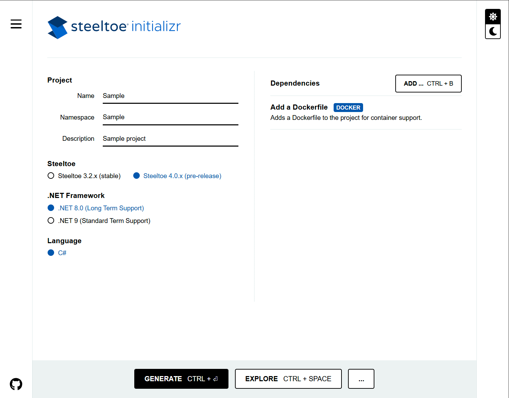
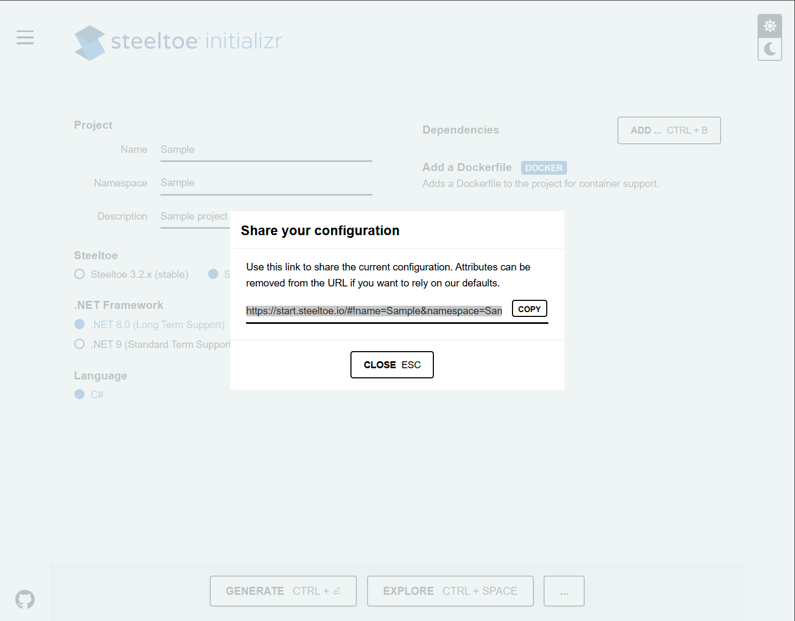

# InitializrWeb

_InitializrWeb_ is a web frontend for an Initializr deployment.
It uses _InitializrApi_-provided project metadata to populate its interface for easy perusal and selection by an end user.
After selecting desired project parameters, an end user uses _InitializrWeb_ to submit project generation requests to the _InitializrApi_.

## Overview

The interface is made up of 4 areas:

* project configuration area
* project action area (bottom)
* UI configuration (right)
* external links (left)

The remainder of this document focuses on the project configuration and action areas.

## Configuration

The configuration area exposes 5 project properties to the end user:

* name
* C# namespace
* application name
* description
* Steeltoe version
* .NET target framework
* .NET template
* dependencies

## Actions

The actions area provides 3 project actions to the end user:

* generate
* explore
* share

### Generate

Clicking "Generate" submits the current configuration to the _InitializrApi_ to generate a project archive.
The resultant project archive is a Zip file named based on the project name.

### Explore

Clicking "Explore" submits the current configuration to the _InitializrApi_ to generate a project archive.
The resultant project archive is expanded in the UI so that the end user can explore the project.

### Share

Clicking "Share" displays a URL that represents the current project configuration.
It can be shared with other developers or saved in a bookmark.
Note that the URL is specific to _InitializrWeb_ and cannot be used directly with the _InitializrApi_.

