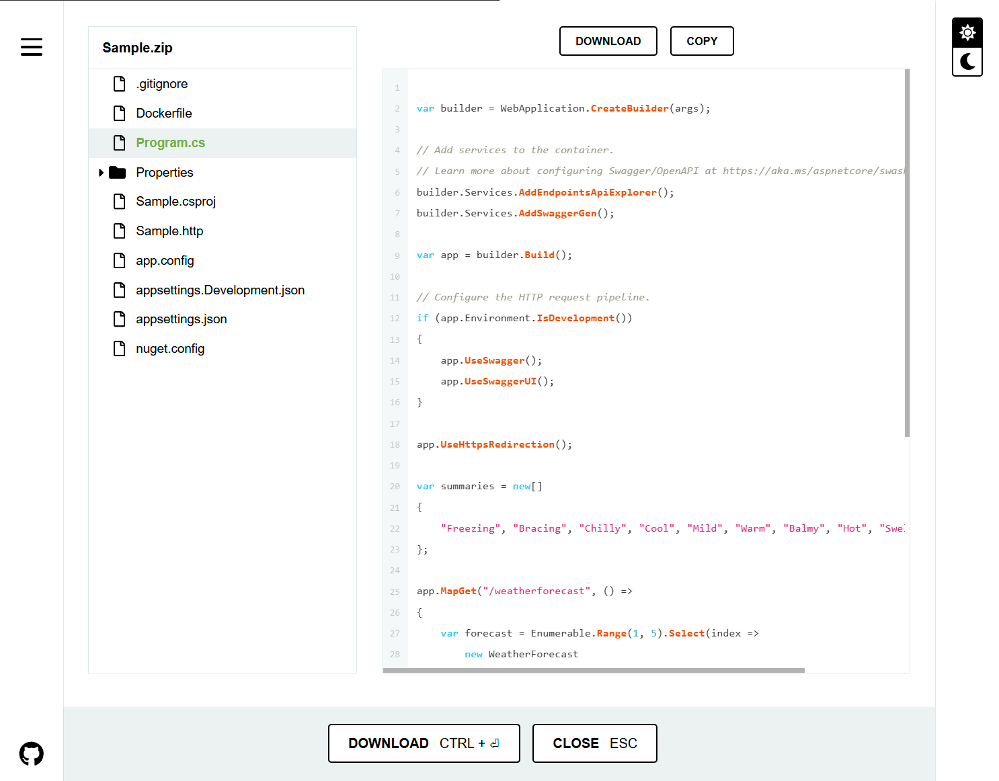

# InitializrWeb

InitializrWeb is a web frontend for an Initializr deployment.
It uses InitializrApi-provided project metadata to populate its interface for easy perusal and selection by an end user.
After selecting desired project parameters, an end user uses InitializrWeb to submit project generation requests to the InitializrApi.

## Overview

The interface is made up of four areas:

* project configuration area
* project action area (bottom)
* Dependencies configuration (right)
* external links (left)

The remainder of this document focuses on the project configuration and action areas.

## Project configuration

The configuration area exposes five project properties to the end user:

* **Name**: application name
* **Namespace**: code namespace
* **Description**: application description
* **Steeltoe**: Steeltoe version
* **.NET Framework**: .NET target framework
* **Language**: The programming language

## Project actions

The actions area provides four project actions to the end user:

* **Generate**
* **Explore**
* **Bookmark**
* **Share**

### Generate

Clicking **Generate** submits the current configuration to the InitializrApi to generate a project archive.
The resultant project archive is a Zip file with a name based on the project name.

### Explore

Clicking **Explore** submits the current configuration to the InitializrApi to generate a project archive.
The resultant project archive is expanded in the UI so that the end user can explore the project.

### Share

Clicking **Share** displays a URL that represents the current project configuration.
It can be shared with other developers or saved in a bookmark.
Note that the URL is specific to InitializrWeb and cannot be used directly with the InitializrApi.

