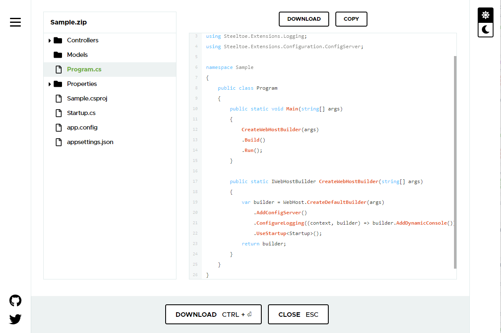

# Create .NET Microservice Projects Automatically with Steeltoe Initializr

Microservices are well… micro. They travel in packs. Very rarely will you find a single microservice in production representing an entire application's capabilities. Normally you have many services that make up the application. Each service is different in what controllers it offers. A user service offers endpoints for looking up a user's account information and validating a user's credentials. A customer service would have ways to interact with customer information. Outside of a microservice's controller, though, they look very similar. Each needs a web server. Each needs to emit logs. Etc.

Then there's shared services. Something like an authentication service is usually backing most of the application's microservices. But something like a cache is only selectively used in certain microservices that have the need. If user information doesn't change that often but is constantly being looked up, it makes sense to do side lookups in a cache. Alternatively, customer information could be constantly changing but requests aren't that high frequency, so the overhead of a cache doesn't make sense.

When you are creating each of these microservices it turns into a rinse-and-repeat exercise. You are tempted to create a template or at least a script to do all the `dotnet new webapi` commands, taking into account namespaces and nuances.

As it turns out this is such a common task, tools have been created to help you through this. One notable tool is the dotnet templating engine. It gives a team the ability to crank out the beginnings of microservices in a flash. The challenge is once you look past a single developer to the entire organization the need for a more distributable model arises quickly. One where different folks with different roles can collaborate to keep best practices a priority and the latest patches a reality, in all new development.

Also, because development doesn't happen in a vacuum, there is a constant flow of new services rolling out to make microservices better/faster/stronger. So when that new microservice is getting underway you want to do what's right (and use that new service) but you don't want to spend hours learning how to implement it.

All of this is why the Steeltoe Initializr project was created. Initializr aims to get you (the developer) going faster, while making the right way the easy way. It does this with extensible APIs that generate production ready .NET projects (csproj). Initializr options are expressed in a metadata model so the tool can grow with the community, as target frameworks change, Steeltoe versions advance, and individual dependencies offer new releases.

## Getting started with Initializr

Initializr has two ways to interact. If you're more familiar with point and click then you'll be right at home with the web UI - [https://start.steeltoe.io](https://start.steeltoe.io/).


The website includes options like naming the project and namespace, picking your project's runtime version, Steeltoe version, and adding in all your needed dependencies.

With those options checked you can “Generate" the project (as zip) and get going in your favorite IDE. Or you “Explore" the source code right in the browser. This is a great way to see exactly what the templating engine will create without the fuss of a zip. If you have an existing microservice that is in need of new Steeltoe features, using the explore function is a great way to see exactly what is needed.


There is also an option to “Share" the newly created project with your co-workers and friends. This makes things very convenient when you don't have a shared screen or public repo handy.

At its core, Steeltoe Initializr offers an API endpoint that takes a project's name, its target framework, and a list of dependencies as arguments.

Let's look at a quick example to get familiar.

We want to create a .NET Core microservice (aka webapi project) that hands us health reporting, dynamic logging levels, and a managed connection to Microsoft SQL Server. Using Steeltoe's public Initializr we could run…

# [Powershell](#tab/powershell)
```powershell
$body = @{Name:"MyProject",Dependencies:"Actuator,Dynamic-Logger,SQLServer"}

Invoke-RestMethod -Method "Post" -Uri "https://start.steeltoe.io/api/project" -Body $body -OutFile "MyProject.zip"

#To unzip
Invoke-RestMethod -Method "Post" -Uri "https://start.steeltoe.io/api/project" -Body $body | Expand-Archive -DestinationPath .
```

# [Bash](#tab/bash)
```bash
$ http https://start.steeltoe.io/api/project -o MyProject -d dependencies=actuator,dynamic-logger,sqlserver
```
***

The result will be a zip of the newly minted csproj. Within are all the best ways to implement Steeltoe actuators, Steeltoe logging, and Steeltoe SQL Server cloud connector.

## Using the Endpoints

If you're on Linux or Macintosh, a terminal session using `curl` or HTTPie it is also very simple. Similar to Powershell, provide the appropriate options and metadata to receive the generated zip.

Through either the web UI or the rest endpoints, Initializr will get your microservices going fast. Which means you'll be checking in a production ready service in no time!

#### Endpoint Home

Sending a GET request to this endpoint (https://start.steeltoe.io/api) will respond with essentials of the service. Things like what parameters can be provided when generating a project and what dependencies are available for use.

#### Generate Project

This endpoint supports both the GET and POST methods. This is where all the Initializr magic happens. As a GET request include parameters in the querystring. As a POST request, provide your project metadata as JSON in the body. Either way the response will be a zip of the generated project.

#### Service Configuration

Initializr's special sauce is the collection of dependencies. It's the reason the tool is so powerful. It's also worthy of an entire discussion - there's quite a few moving parts. We're not going to get too deep in Initializr's inner workings at this time. So, if you would like to get deeper the [project's documentation](https://docs.steeltoe.io/api/v3/initializr) is waiting just for you.

When Initializr generates a new project that has added dependencies, the templating is used to “fill in the blanks”. Let see an example of this in action.

Say we want to create a new .NET Core webapi microservice that has health checking built in and is going to connect with a Microsoft SQL database. On [start.steeltoe.io](https://start.steeltoe.io) you could choose the “Actuators” dependency and the “Microsoft SQL Server” dependency. Then “Generate” the project and you're on the way to cloud-native nirvana.

Initializr's special sauce is the collection of dependencies. It's the reason the tool is so powerful. It's also worthy of an entire discussion - there's quite a few moving parts. We're not going to get too deep in Initializr's inner workings except to show how the pieces fit together. If you would like to get deeper, the [project's documentation](/api/v3/initializr) is waiting just for you.

Initializr uses the [mustache templating engine](https://mustache.github.io/). Rules are declared within each .cs implementing a given dependencies best practice. Let's say you wanted to create a new .NET Core webapi microservice that uses Spring Cloud Config server and management actuators for reporting health. You could start with `dotnet new webapi` and then add each package with `dotnet add package Steeltoe.<package extension>`. The result would be a good starting place but you would still need to implement each feature with its corresponding `.Use<package>` statement. And you might not notice that two decisions were made "behind the scenes". The version of .NET sdk installed will be the version of .NET for the project and the latest release of Steeltoe packages will be used within.

Say we want to create a new .NET Core webapi microservice that has health checking built in and is going to connect with a Microsoft SQL database. In the UI you could choose the "Actuators" and "Microsoft SQL Server" dependency. Then "Generate" the project and you're on the way to cloud-native nirvana. Or you could run the following command.

# [Powershell](#tab/powershell)

```powershell
$body = @{Name:"MyProject",Dependencies:"actuator,sqlserver"}

Invoke-RestMethod -Method "Post" -Uri "https://start.steeltoe.io/api/project" -Body $body -OutFile "MyProject.zip"
```

# [Bash](#tab/bash)

```bash
#Using cURL
curl https://start.steeltoe.io/api/project -o MyProject -d dependencies=actuator,sqlserver
```
***

Repeatability and consistency are the name of the game when it comes to creating new ASP.NET microservices. The faster you can get the right project going, the faster your services can get to production!

## Getting started with Initializr

Initializr has two ways to interact. If you're more familiar with point and click then you'll be right at home with the web UI - [https://start.steeltoe.io](https://start.steeltoe.io/).


The website includes options like naming the project and namespace, picking your project’s runtime version, choosing between supported Steeltoe versions, and adding in all your needed dependencies. With those options checked you can "Generate" the project (as zip) and get going in your favorite IDE. Or you "Explore" the source code in the browser. This is a great way to see exactly what the templating engine will create without the fuss of a zip. If you have an existing microservice that is in need of new Steeltoe features, using the explore function is a great way to see exactly what is needed.



There is also an option to "Share" the newly created project with your co-workers and friends. This makes things very convenient when you don’t have a shared screen or public repo handy.

If interacting with web services are more of your fancy, then Initializr's REST endpoints are the place to be. You won't be missing out on any options the UI offers, as the UI uses the endpoints internally. On a Windows desktop, powershell's Invoke-RestMethod will interact perfectly. Just provide the endpoint address, method, and outfile. If you're generating a new project all it's metadata can be included in the body.

If you're on Linux or Apple desktop a terminal session using `curl` or `http` is also very simple. Similarly to powershell, these commands provide the appropriate options and metadata to receive the generated zip.

Through either the web UI or the REST endpoints, Initializr will get your microservices going fast. Which means you'll be checking in a production ready service in no time!
