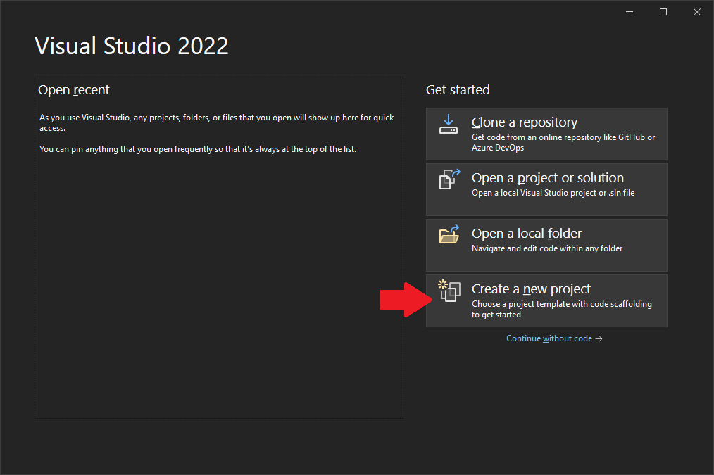
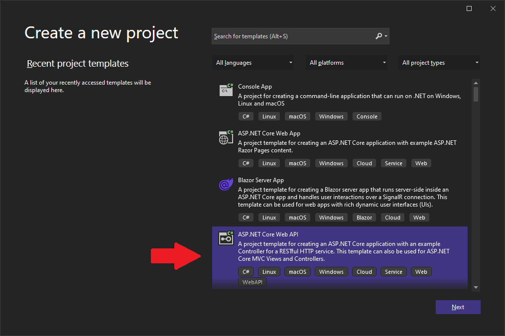
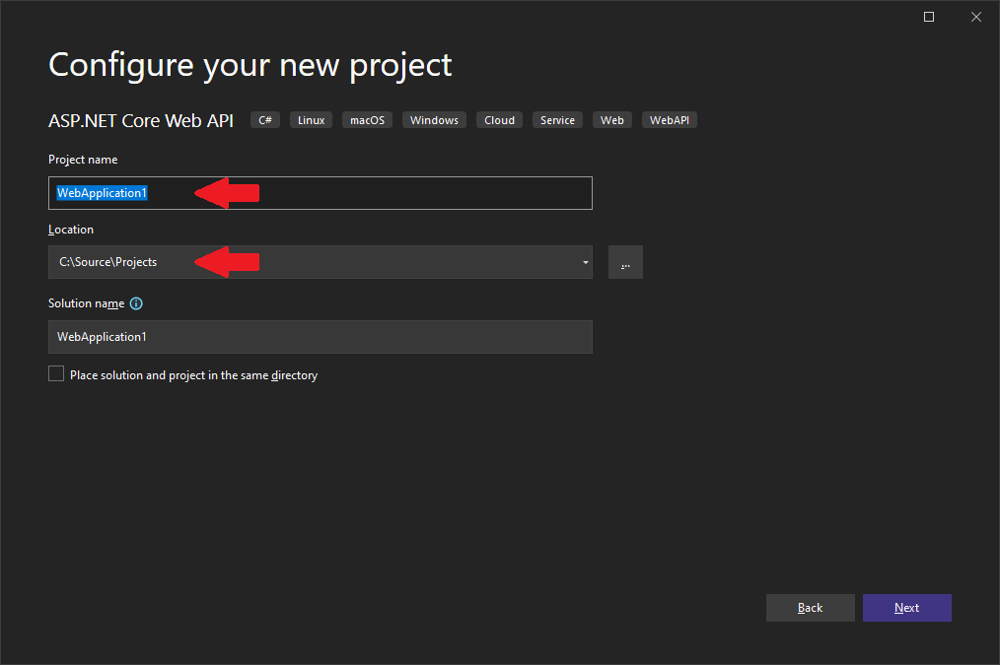
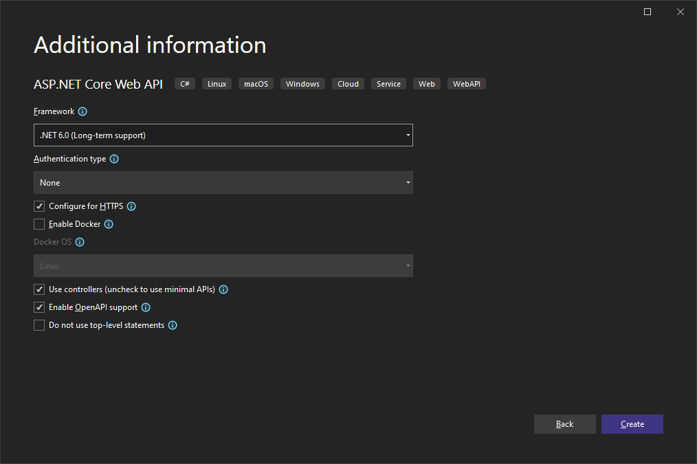
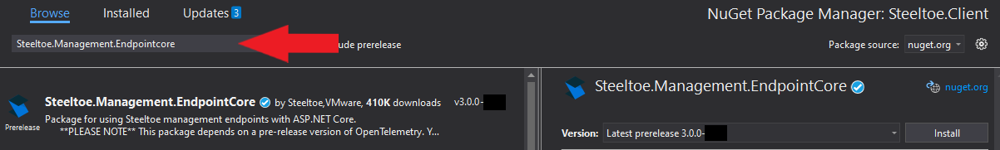
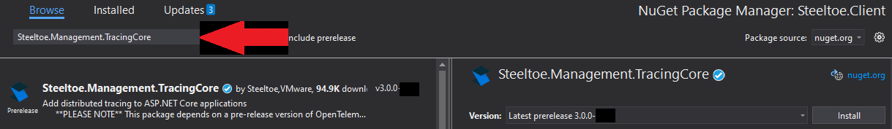
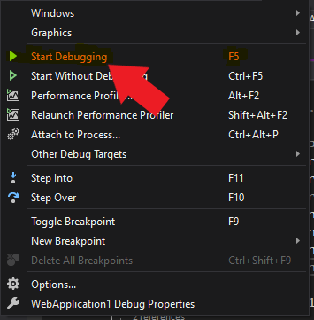
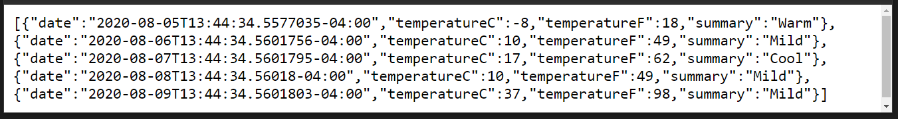
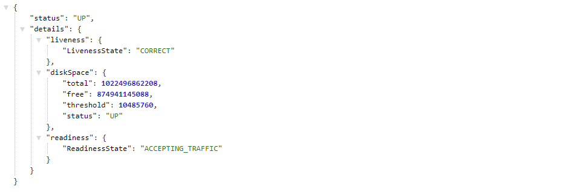
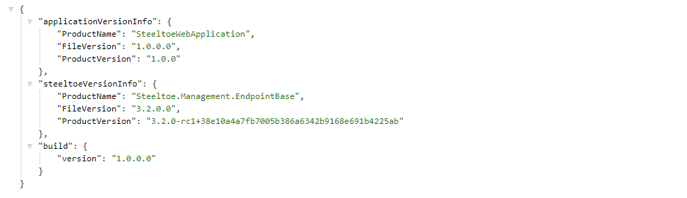

> [!NOTE]
> This guide applies to Steeltoe v3. Please [open an issue](https://github.com/SteeltoeOSS/Documentation/issues/new/choose) if you'd like to help update the content for Steeltoe v4.

[exercise-1-link]: exercise1.md
[exercise-2-link]: exercise2.md
[exercise-3-link]: exercise3.md
[exercise-4-link]: exercise4.md

| [<< Home](index.md) | [Next Exercise >>][exercise-2-link] |
| :------------------ | ----------------------------------: |

# Getting to know Steeltoe

## Goal

Understand how Steeltoe is distributed (NuGet) and how one adds components into an existing application.

## Expected Results

Begin building an API that will be enhanced with more components in the next exercise(s).

## Get Started

Let's start by creating a brand new ASP.NET Core Web API project.

# [Visual Studio](#tab/visual-studio)

Select "Create a new project". (If Visual Studio is already open, choose `File > New > Project`.)


Choose "ASP.NET Core Web API" from the default templates.


The default project name WebApplication1 will be used throughout, but you can rename it.


At "Additional information", you can keep the default values.


# [.NET CLI](#tab/dotnet-cli)

```powershell
dotnet new webapi -n WebApplication1
cd WebApplication1
```

To use Visual Studio as your IDE, open the Visual Studio program, choose "Open a project or solution" and select the file "WebApplication1.sln".

To use VS Code as your IDE:

```powershell
code .
```

---

## Add Project Dependencies

Once the project is created and opened in your IDE, the first action is to bring in the Steeltoe packages to the app.

# [Visual Studio](#tab/visual-studio)

Right-click on the project name in the solution explorer and choose "Manage NuGet packages...." In the package manager window, choose "Browse", then search for `Steeltoe.Management.EndpointCore`, and install.


Finally the `Steeltoe.Management.TracingCore` package and install.


# [.NET CLI](#tab/dotnet-cli)

```powershell
dotnet add package Steeltoe.Management.EndpointCore
dotnet add package Steeltoe.Management.TracingCore
```

---

## Use Steeltoe packages

Steeltoe features are broken up into packages, giving you the option to be selective about which components are included. As we use each of these packages within the application, we'll discuss why they were chosen.

Open "Program.cs" in the IDE and add the next using statement:

```csharp
using Steeltoe.Management.Endpoint;
```

Then append the 'adding' statements to the application builder and save the changes

```csharp
// Add services to the container.

// Steeltoe actuators
builder.AddHealthActuator();
builder.AddInfoActuator();
builder.AddLoggersActuator();
```

We've just included three features within the application by adding these actuators.

- The [health actuator](/api/v3/management/health.md) adds a new endpoint at `/actuator/health`. This endpoint retrieves health contributors that have been registered in the application's service container with either Steeltoe's `IHealthContributor` or Microsoft's `IHealthRegistration` to aggregate the health checks of all the application's dependencies. This endpoint use the HTTP status code of [200](https://developer.mozilla.org/en-US/docs/Web/HTTP/Status/200) when everything is OK and [503](https://developer.mozilla.org/en-US/docs/Web/HTTP/Status/503) when it isn't. Details of the health checks can be included in JSON-formatted responses, too.
- The [info actuator](/api/v3/management/info.md) adds a new endpoint at `/actuator/info`. This function gathers all kinds of information like versioning information, select package information, and anything you'd like to include with your own custom `IInfoContributor`. Everything is formatted as JSON and included in the response.
- The [logger actuator](/api/v3/management/loggers.md) enables dynamic log level management at runtime and enhanced log message details via `ILogger`.

## Enable distributed tracing

In "Program.cs", add the next using statement

```csharp
using Steeltoe.Management.Tracing;
```

Add the distributed tracing feature to the service container:

```csharp
// Add services to the container.

// Steeltoe distributed tracing
builder.Services.AddDistributedTracingAspNetCore();
```

With the addition of the distributed tracing option, under the covers, Steeltoe uses the OpenTelemetry specification to generate and propagate spans and traces throughout the application, as requests are received. No additional configuration is needed, but if you wanted to manipulate how traces and spans are created you could provide settings in "appsettings.json", [read the docs](/api/v3/tracing/index.md#configure-settings) for more information.

> [!TIP]
> Having the combination of the logging actuator and distributed tracing enabled, Steeltoe will automatically append the application name, span Id, and trace Id on log messages when possible. This can be very handy when debugging a specific happening or error in production.

## Add a sample logging message

To see the trace logging in action, let's add a log message in the "Controllers\WeatherForecastController.cs" controller class. Append the below message as the first line in the `Get` method.

```csharp
[HttpGet]
public IEnumerable<WeatherForecast> Get()
{
    // Testing Steeltoe logging with distributed tracing
    _logger.LogInformation("Hi there");

    // ...
}
```

## Run the application

With the packages registered in the application builder, distributed tracing activated, and a sample log message being written to the console, we are ready to see everything in action. Run the application.

# [Visual Studio](#tab/visual-studio)

Click the `Debug > Start Debugging` top menu item. You may be prompted to "trust the IIS Express SSL certificate" and install the certificate. Once started, your default browser should open and automatically load the weather forecast endpoint.



# [.NET CLI](#tab/dotnet-cli)

Executing the below command will start the application. You will see a log message written, telling how to navigate to the application. It should be [https://localhost:7010/weatherforecast](https://localhost:7010/WeatherForecast).

```powershell
dotnet run
```

---

With the application running and the weather forecast endpoint loaded, your browser should show the following



> [!NOTE]
> If "Enable OpenAPI support" was checked at project creation, the Swagger endpoint is used as the startup page. Replace "swagger/index.html" with "WeatherForecast" to get the response above.

## Discover the health endpoint

Let's look at the health endpoint. Replace `WeatherForecast` with `actuator/health` in the browser address bar. The health page will load with JSON formatted info.



As we discussed above, the fact that the page loaded (status of 200) is the first communication to the application's platform that it is healthy. Secondarily, the application has output information to help certain platforms gain a deeper knowledge of app health. Learn more about the health endpoint [here](/api/v3/management/health.md).

## Discover the info endpoint

Now navigate to the info endpoint by replacing `health` with `info` in the address bar.



We have loaded the bare minimum application info for this example. You could build your own `IInfoContributor` and add all kinds of metadata and connection information. Learn more [here](/api/v3/management/info.md).

## Observe trace and spans appended to logs

Finally, let's look at the log message that was written.

Go back to the terminal window where the application was started. The logs should be streaming. Locate the following line:

```plaintext
[WebApplication1, 917e146c942117d2, 917e146c942117d2, true] Hi there
```

---

Notice the additional information prepended to the message. This will be automatically written to logs, so whatever platform or cloud you might be using, the message will give you quite a bit of context.

- The first item is the application's name
- Second is the OpenTelemetry generated span id
- Third is the OpenTelemetry generated trace id

## Stop the application

# [Visual Studio](#tab/visual-studio)

Either close the browser window or click the red stop button in the top menu.

# [.NET CLI](#tab/dotnet-cli)

Use the key combination "Ctrl+C" on Windows/Linux or "Cmd+C" on Mac.

---

## Summary

These are the basics of any cloud ready microservice. Logging and debugging are significantly different than a traditional IIS environment. But! A developer shouldn't be spending tons of time coding these boilerplate-type things. Heeelllo Steeltoe!

|     | [Next Exercise >>][exercise-2-link] |
| :-- | ----------------------------------: |
