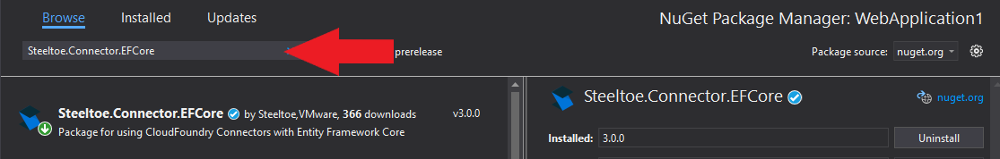
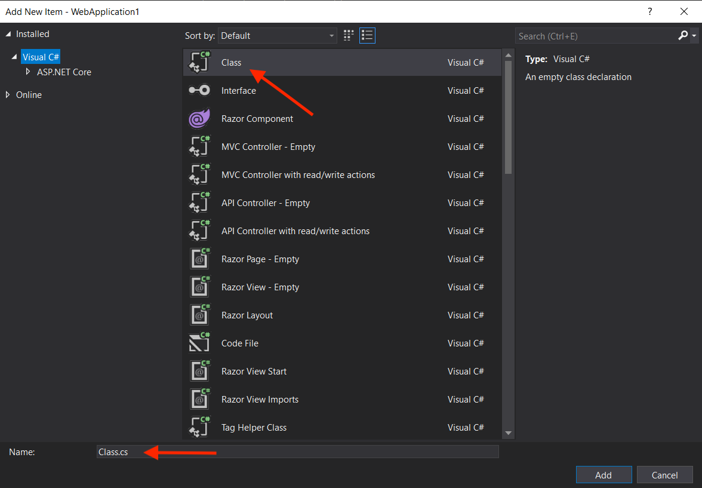
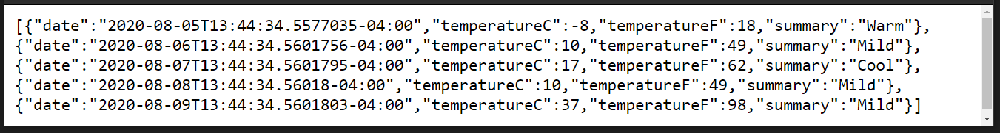
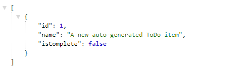

> [!NOTE]
> This guide applies to Steeltoe v3. Please [open an issue](https://github.com/SteeltoeOSS/Documentation/issues/new/choose) if you'd like to help update the content for Steeltoe v4.

[home-page-link]: index.md
[exercise-1-link]: exercise1.md
[exercise-2-link]: exercise2.md
[exercise-3-link]: exercise3.md
[exercise-4-link]: exercise4.md

| [<< Previous Exercise][exercise-2-link] | [Next Exercise >>][exercise-4-link] |
| :-------------------------------------- | ----------------------------------: |

# Adding a cloud connector with SQL

## Goal

Add a ToDo list database context and item model to the app to see how Steeltoe manages the connection.

## Expected Results

App initializes the database and serves a new endpoint for interacting with ToDo list items.

> [!NOTE]
> For this exercise, a Microsoft SQL Server database has already been initialized. The settings have been preloaded below.

## Get Started

We're going to add a database connection and context using Entity Framework Core to the previously created application.

# [Visual Studio](#tab/visual-studio)

Right-click on the project name in the solution explorer and choose "Manage NuGet packages...". In the package manager window, choose "Browse", then search for `Steeltoe.Connector.EFCore`, and install.


Then search for the `Microsoft.EntityFrameworkCore.SqlServer` package and install.


# [.NET CLI](#tab/dotnet-cli)

```powershell
dotnet add package Steeltoe.Connector.EFCore
dotnet add package Microsoft.EntityFrameworkCore.SqlServer
```

---

## Add database context and model

Now create a new folder in the project named 'Models'.

# [Visual Studio](#tab/visual-studio)

Right-click on the project name in the solution explorer, choose "Add" > "New Folder" and name it `Models`.


# [.NET CLI](#tab/dotnet-cli)

```powershell
mkdir "Models"
cd "Models"
```

---

Within that folder, create a new class named "TodoItem.cs". This will serve as a definition of the things that make up a ToDo list item.

Right-click on the 'Models' folder, choose "Add" > "Class..." and name it `TodoItem.cs`.



Open the newly created class file in your IDE and replace the class declaration with the code below. Don't change the 'namespace' part, just the class within the namespace.

```csharp
public class TodoItem
{
    public long Id { get; set; }
    public string? Name { get; set; }
    public bool IsComplete { get; set; }
}
```

> [!TIP]
> The 'TodoItem' class is what's known as a POCO. Plain Old CLR Object. No fancy stuff... you don't even need the default 'using' statements if you'd like to remove them.

Also within that folder, create a new class named 'TodoDbContext.cs'. This class will serve as our database context for interacting with the database.

Right-click on the 'Models' folder, choose "Add" > "Class..." and name it `TodoDbContext.cs`.


Open the newly created class file in your IDE and reference the 'EntityFrameworkCore' namespace.

```csharp
using Microsoft.EntityFrameworkCore;
```

Also replace the class declaration with the code below. Don't change the 'namespace' part, just the class within the namespace.

```csharp
public class TodoDbContext : DbContext
{
    public DbSet<TodoItem> TodoItems => Set<TodoItem>();

    public TodoDbContext(DbContextOptions<TodoDbContext> options)
        : base(options)
    {
    }
}
```

## Register the database context and ensure its creation

Now that we have created the 'TodoDbContext', we need to add it to the service container.

> [!NOTE]
> If prompted, there is no need to add any other packages such as SqlClient. The Steeltoe package takes care of everything.

Open "Program.cs" in your IDE and add the next using statement

```csharp
using Steeltoe.Connector.SqlServer.EFCore;
```

Then append the 'add db' statement and save the changes

```csharp
// Add services to the container.

builder.Services.AddDbContext<Models.TodoDbContext>(options => options.UseSqlServer(builder.Configuration));
```

Because we are going to be interacting with a brand new database instance, we'll need to make sure the database has been initialized before the application can fully start up. In "Program.cs", add the code below.

```csharp
var app = builder.Build();

await using var scope = app.Services.CreateAsyncScope();
await using var dbContext = scope.ServiceProvider.GetRequiredService<Models.TodoDbContext>();
await dbContext.Database.EnsureCreatedAsync();
```

## Create a ToDo controller

Create a new class in the 'Controllers' folder named `TodoItemsController.cs`.

Right-click on the 'Controllers' folder, choose "Add" > "Class..." and name it `TodoItemsController.cs`.


Open the newly created class file in your IDE and replace the 'using' statements in the file with the ones below.

```csharp
using Microsoft.AspNetCore.Mvc;
using Microsoft.EntityFrameworkCore;
using WebApplication1.Models;
```

Replace the class declaration with the code below. Don't change the 'namespace' part, just the class within the namespace.

```csharp
[Route("api/[controller]")]
[ApiController]
public class TodoItemsController : ControllerBase
{
    private readonly TodoDbContext _dbContext;
    private readonly ILogger<TodoItemsController> _logger;

    public TodoItemsController(TodoDbContext dbContext, ILogger<TodoItemsController> logger)
    {
        _dbContext = dbContext;
        _logger = logger;
    }

    // GET: api/TodoItems
    [HttpGet]
    public async Task<ActionResult<IEnumerable<TodoItem>>> GetTodoItems()
    {
        return await _dbContext.TodoItems.ToListAsync();
    }

    // GET: api/TodoItems/5
    [HttpGet("{id}")]
    public async Task<ActionResult<TodoItem>> GetTodoItem(long id)
    {
        if (id == 0)
        {
            var newItem = new TodoItem
            {
                IsComplete = false,
                Name = "A new auto-generated ToDo item"
            };

            _dbContext.TodoItems.Add(newItem);
            await _dbContext.SaveChangesAsync();

            _logger.LogInformation("Super secret id==0 was provided, so a new item was auto-added.");
            return Ok("Item created.");
        }

        var todoItem = await _dbContext.TodoItems.FindAsync(id);

        if (todoItem == null)
        {
            return NotFound();
        }

        return todoItem;
    }
}
```

## Update appsettings.json with database connection

To get a running instance of SQL, you could go a few different paths. Depending on how the instance is made available, you'll want to adjust the values in `appsettings.json`.

# [Visual Studio LocalDB](#tab/Visual-Studio-LocalDB)

If your Visual Studio installation has this feature enabled (there's a very good chance), then you have a ready-to-go SQL instance. Uncomment the `ConnectionString` option. If you would like to confirm the database server is running, open powershell and run `sqllocaldb i MSSQLLocalDB`.

# [Local & Docker SQL](#tab/Local-SQL)

Local installations of SQL Server are usually available on `localhost:1433`. If so, then Steeltoe can connect with the built-in default settings and you won't need anything from the JSON below. Otherwise, uncomment the provided parameters (server, port, etc) to configure the connection correctly.

Should you require one, here is an example docker command for running a SQL Server instance:

```powershell
docker run -e "ACCEPT_EULA=Y" -e "SA_PASSWORD=IheartSteeltoe1" -p 1433:1433 -d mcr.microsoft.com/mssql/server:2022-latest
```

# [Other](#tab/other-sql)

If your SQL instance is running somewhere else, you'll need its URI port number and credentials. Uncomment the provided parameters to configure the connection correctly.

***

Add the below JSON to 'appsettings.json', just after the 'management' section. This will give Steeltoe connection information for the database instance, as well as name the new database.

```json
,"SqlServer": {
  "Credentials": {
    //"ConnectionString": "Server=(localdb)\\mssqllocaldb;database=Todo;Trusted_Connection=True;"
    //"Server": %%SQL_SERVER_ADDRESS%%,
    //"Port": %%SQL_SERVER_PORT%%,
    //"Username": %%SQL_SERVER_USERNAME%%,
    //"Password": %%SQL_SERVER_PASSWORD%%,
    //"Database": %%SQL_SERVER_DATABASE%%
  }
}
```

## Review what was done

Before we see everything in action, let's review what has been done. With the Steeltoe EFCore package added, we created a definition of a database context and list item. Then we registered them at startup in the dependency injection container. Instead of bringing in the typical SqlClient packages to help define things, we used `Steeltoe.Connector.SqlServer.EFCore`. This package not only has all the needed sub-packages included, but also introduces another way of configuring server settings. To learn more about what values can be customized, [have a look at the docs](/api/v3/connectors/microsoft-sql-server.md). In our example, we're using the default port of `1433` and a server name of `localhost`. If you wanted the app to connect to a SQL database hosted elsewhere you could provide different values, or rely on built-in support for [service bindings](/api/v3/connectors/usage.md#cloud-foundry). Also, we've provided the required credentials and server name in `appsettings.json`. The database name will be derived from our ToDo database context. The key is to give the Steeltoe connector a valid healthy connection to a SQL instance, it will do the rest.

## Run the application

With the data context in place, we are ready to see everything in action. Run the application.

# [Visual Studio](#tab/visual-studio)

Click the `Debug > Start Debugging` top menu item. You may be prompted to "trust the IIS Express SSL certificate" and install the certificate. Once started, your default browser should open and automatically load the weather forecast endpoint.


# [.NET CLI](#tab/dotnet-cli)

Executing the below command will start the application. You will see a log message written, telling you how to navigate to the application. It should be [http://localhost:5000/weatherforecast](http://localhost:5000/weatherforecast).

```powershell
dotnet run
```

---

With the application running and the weather forecast endpoint loaded your browser should show the following



> [!NOTE]
> If "Enable OpenAPI support" was checked at project creation, the Swagger endpoint is used as the startup page. Replace "swagger/index.html" with "WeatherForecast" to get the response above.

## Work with saved ToDo items

To test the database connection, navigate to the "GET" endpoint where all saved ToDo list items will be retrieved. **Oh wait!** It's a new database, so there aren't any items saved yet. Let's add a new ToDo list item.

You may have noticed in the `TodoItemsController.GetTodoItem` method, that there is a super secret value you can provide to add new list items. Replace `WeatherForecast` with `api/TodoItems/0` in the browser address bar. This page should load successfully and return "Item created". Behind the scenes, you've just added a new ToDo item. To confirm, let's retrieve the saved list of items. Remove the `/0` in the address and load the page. Wow! Now there is one ToDo item retrieved from the database. Awesome!



## Stop the application

# [Visual Studio](#tab/visual-studio)

Either close the browser window or click the red stop button in the top menu.

# [.NET CLI](#tab/dotnet-cli)

Use the key combination "Ctrl+C" on Windows/Linux or "Cmd+C" on Mac.

---

## Summary

We've done quite a bit in this exercise, but notice it was mostly focused on working with the ToDo list. You never had to open a SQL editor, create a database, test the database, etc, etc. That's the purpose of the Steeltoe Connectors. They take care of all the messy behind-the-scenes work and let you focus on the business logic. Yeah we know, it's pretty awesome. Being awesome is one of Steeltoe's superpowers.

| [<< Previous Exercise][exercise-2-link] | [Next Exercise >>][exercise-4-link] |
| :-------------------------------------- | ----------------------------------: |
