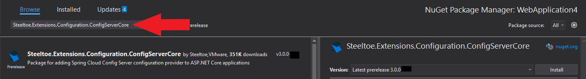
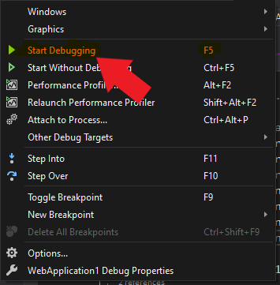

> [!NOTE]
> This guide applies to Steeltoe v3. Please [open an issue](https://github.com/SteeltoeOSS/Documentation/issues/new/choose) if you'd like to help update the content for Steeltoe v4.

[home-page-link]: index.md
[exercise-1-link]: exercise1.md
[exercise-2-link]: exercise2.md
[exercise-3-link]: exercise3.md
[exercise-4-link]: exercise4.md
[summary-link]: summary.md

| [<< Previous Exercise][exercise-3-link] |     |
| :-------------------------------------- | --: |

# Using an external configuration provider

## Goal

Set up an external git repo holding configuration values and using Spring Config to retrieve the values, in a .NET Core application.

## Expected Results

With a running instance of Spring Config server, navigate to an endpoint in a .NET Core application and see the values output.

> [!NOTE]
> For this exercise a Spring Config server has already been initialized. The settings have been preloaded below.

## Get Started

To communicate with an external config server, we're going to need to add a client to the previously created application.

# [Visual Studio](#tab/visual-studio)

Right-click on the project name in the solution explorer and choose "Manage NuGet packages...". In the package manager window, choose "Browse", then search for `Steeltoe.Extensions.Configuration.ConfigServerCore`, and install.



# [.NET CLI](#tab/dotnet-cli)

```powershell
dotnet add package Steeltoe.Extensions.Configuration.ConfigServerCore
```

---

## Use Spring Cloud Config Server client

Open "Program.cs" and register a configuration provider for Spring Config Server client in the application builder.

```csharp
using Steeltoe.Extensions.Configuration.ConfigServer;
```

```csharp
// Add services to the container.

// Steeltoe config server client
builder.AddConfigServer();
```

## Create a Values controller

Right-click on the 'Controllers' folder, choose "Add" > "Class..." and name it `ValuesController.cs`.


Open the newly created class file in your IDE and replace the 'using' statements in the file with the one below.

```csharp
using Microsoft.AspNetCore.Mvc;
```

Replace the class declaration with the code below. Don't change the 'namespace' part, just the class within the namespace.

```csharp
[Route("[controller]")]
[ApiController]
public class ValuesController : ControllerBase
{
    private readonly IConfiguration _configuration;
    private readonly ILogger<ValuesController> _logger;

    public ValuesController(IConfiguration configuration, ILogger<ValuesController> logger)
    {
        _configuration = configuration;
        _logger = logger;
    }

    // GET api/values
    [HttpGet]
    public ActionResult<IEnumerable<string>> Get()
    {
        var value1 = _configuration["Value1"];
        var value2 = _configuration["Value2"];

        return new[] { value1, value2 };
    }
}
```

In 'appsettings.json', add the following JSON just below the "SqlServer" section. This should be preloaded with the correct connection values of a Spring Config server.

> [!NOTE]
> If you do not have a Spring Cloud Config Server running, please follow the instructions in [App Configuration with a Spring Config Server](../application-configuration/spring-config.md) in the Steeltoe Getting Started Guide.

```json
,"Spring": {
  "Application": {
    "Name": "my-values"
  },
  // Below is not needed if you are running a local Config Server
  "Cloud": {
    "Config": {
      "ValidateCertificates": false,
      "FailFast": %%SPRING_CONFIG_FAILFAST%%,
      "Uri": %%SPRING_CONFIG_URI%%,
      "Username": %%SPRING_CONFIG_USERNAME%%,
      "Password": %%SPRING_CONFIG_PASSWORD%%
    }
  }
}
```

> [!NOTE]
> Notice the value of 'spring:application:name' in the JSON. This value of "my-values" will be used to locate the correct values in the Spring Config server.

## Run the application

With the data context in place, we are ready to see everything in action. Run the application.

# [Visual Studio](#tab/visual-studio)

Click the `Debug > Start Debugging` top menu item. You may be prompted to "trust the IIS Express SSL certificate" and install the certificate. Once started, your default browser should open and automatically load the weather forecast endpoint.



# [.NET CLI](#tab/dotnet-cli)

Executing the below command will start the application. You will see a log message written, telling you how to navigate to the application. It should be [http://localhost:5000/weatherforecast](http://localhost:5000/weatherforecast).

```powershell
dotnet run
```

---

With the application running and the weather forecast endpoint loaded your browser should show the following


> [!NOTE]
> If "Enable OpenAPI support" was checked at project creation, the Swagger endpoint is used as the startup page. Replace "swagger/index.html" with "WeatherForecast" to get the response above.

## See the config values output

To execute the values endpoint, replace `WeatherForecast` with `values` in the browser address bar. The values will be retrieved from the Spring Config server and output in the window.

```json
["some-val","another-val"]
```

## Stop the application

# [Visual Studio](#tab/visual-studio)

Either close the browser window or click the red stop button in the top menu.

# [.NET CLI](#tab/dotnet-cli)

Use the key combination "Ctrl+C" on Windows/Linux or "Cmd+C" on Mac.

---

## Summary

With an existing Spring Config server running that was configured to retrieve values from a YAML file, we added a Spring Config client to our application and output the retrieved values. With this architecture in place, you can now do things like update the YAML file and visit the `/actuator/refresh` management endpoint in the application. This will automatically refresh values within the application, without downtime (or restart). You could store a server's connection name in the YAML and have the application retrieve the value. As the application moves through different environments (dev, test, staging, prod) the connection value can change, but the original tested application stays unchanged.

We've just begun to scratch the surface of what Spring Cloud Config Server can really do and all its many features. Learn more about [using Spring Cloud Config Server with Steeltoe](/api/v3/configuration/config-server-provider.md).

| [<< Previous Exercise][exercise-3-link] | [Workshop Summary >>][summary-link] |
| :-------------------------------------- | ----------------------------------: |
