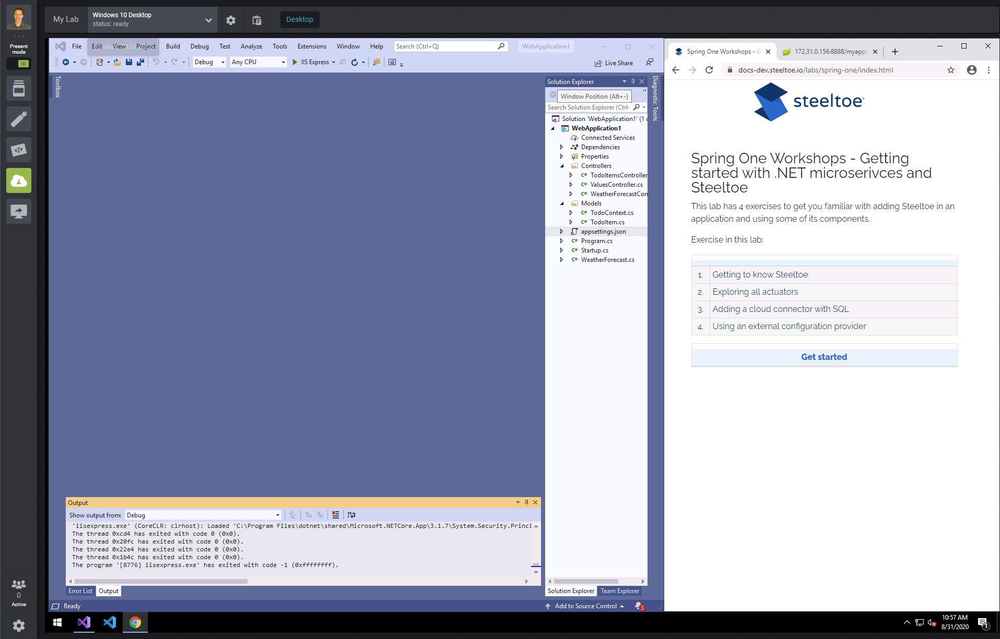
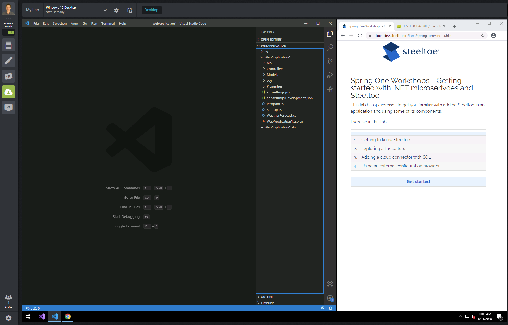

> [!NOTE]
> This guide applies to Steeltoe v3. Please [open an issue](https://github.com/SteeltoeOSS/Documentation/issues/new/choose) if you'd like to help update the content for Steeltoe v4.

[exercise-1-link]: exercise1.md
[exercise-2-link]: exercise2.md
[exercise-3-link]: exercise3.md
[exercise-4-link]: exercise4.md

## Getting started with .NET microservices and Steeltoe

Are you creating new .NET microservices for the cloud? Modernizing existing applications? Or are you just plain moving apps to containers? In all cases, Steeltoe is here to make your life much easier. In this workshop, we’ll take a basic ASP.NET Core Web API project, and make it a cloud rock star with (surprisingly) little code. Along the way the app will use:

- Steeltoe actuator endpoints
- Spring Cloud Config Server for centralized configuration
- MSSQL cloud connectors for dynamically bound cloud services

This lab has 4 exercises to get you familiar with adding Steeltoe to an application and using a few of its components:

|     |                                          |
| :-: | :--------------------------------------- |
| 1.  | Getting to know Steeltoe                 |
| 2.  | Exploring all actuators                  |
| 3.  | Adding a cloud connector with SQL        |
| 4.  | Using an external configuration provider |

> [!TIP]
> As you make your way through the labs, the idea is to place your IDE and the lab steps side-by-side. Before continuing with the workshop, go ahead and open your preferred IDE by clicking either the purple Visual Studio icon or the blue VS Code icon in the taskbar.

With Visual Studio as your IDE

With VS Code as your IDE

| [Get started][exercise-1-link] |
| :----------------------------: |
