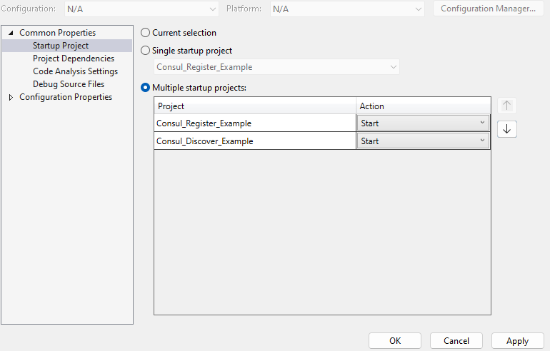

> [!NOTE]
> This guide applies to Steeltoe v3. Please [open an issue](https://github.com/SteeltoeOSS/Documentation/issues/new/choose) if you'd like to help update the content for Steeltoe v4.

## Using Service Discovery with HashiCorp Consul server

This tutorial takes you through setting up two .NET Core applications using services discovery. The first will register it's endpoints for discovery, and the second will discover the first's services.

First, **start a HashiCorp Consul server**. There are a variety of ways to get a Consul server, but using this command will create a server that will be cleaned up automatically after you stop it:

```powershell
docker run --rm -ti -p 8500:8500 --name=steeltoe_guide_consul consul
```

Next, **create a .NET Core WebAPI** and configure Steeltoe to register with the Consul server.

# [Visual Studio](#tab/visualstudio-create1)

* From the File menu, select New > Project.
* Enter Web API in the search box.
* Select the ASP.NET Core Web API template and select Next.
* In the Configure your new project dialog, name the project "Consul_Register_Example" and select Next.
* In the Additional information dialog:
  * Confirm the Framework is .NET 6.0 (Long-term support).
  * Confirm the checkbox for Use controllers(uncheck to use minimal APIs) is checked.
  * Select Create.
* Use the NuGet Package Manager to add a reference to `Steeltoe.Discovery.Consul`

# [dotnet CLI](#tab/dotnet-create1)

First, open your preferred shell and navigate to the folder you'd like the sample created in.

```powershell
# create the project
dotnet new webapi --name Consul_Register_Example

# enter the project directory
cd .\Consul_Register_Example\

# add the NuGet reference
dotnet add Steeltoe.Discovery.Consul
```

---

Open `program.cs` and add the following `using` and code:

```csharp
using Steeltoe.Discovery.Client;

// Add services to the container.
builder.Services.AddDiscoveryClient();
```

Now when the application starts up, Steeltoe will activate the appropriate discovery client. In this case, Consul is the only one configured, but you could add multiple package references and switch between them with application configuration.

---

# [dotnet CLI](#tab/dotnet-run1)

When the application is run directly, Steeltoe should be able to register with the default settings.

```powershell
dotnet run
```

# [Visual Studio (Consul_Register_Example)](#tab/visualstudio-run1)

There are several ways to start this application in Visual Studio using the project profile, choose whichever you prefer:

* Right click on the project name (Consul-Discover-Example) and select Debug -> Start New Instance
* Press F5
* Click the "Start" or "Start Without Debugging" button in the standard toolbar

# [Visual Studio (IIS Express)](#tab/iis-run1)

Steeltoe isn't always able to accurately determine hostname and port when running behind servers like IIS Express, so additional settings need to be configured with this arrangement.

Find the port number the app will be served on in `Properties\launchSettings.json`. The default configuration may redirect to HTTPS, so `sslPort` is most likely the port you want to copy:

```json
  "iisSettings": {
    "windowsAuthentication": false,
    "anonymousAuthentication": true,
    "iisExpress": {
      "applicationUrl": "http://localhost:25835",
      "sslPort": 44338
    }
  },
```

Update `appsettings.json` with host, port and scheme as needed:

```json
{
  "$schema": "https://steeltoe.io/schema/v3/schema.json",
  "Consul": {
    "Discovery": {
      "HostName": "localhost",
      "Port": 44338,
      "Scheme": "https"
    }
  }
}
```

> [!TIP]
> Need to customize more settings when connecting to Consul? Have a look at the [Service Discovery with Consul docs](/api/v3/discovery/hashicorp-consul.md).

---

1. Confirm the application is up and running
    * By default, Visual Studio will open a browser when the app starts
    * Alternatively navigate to the weather endpoint by changing the port [in this link](http://localhost:5000/api/WeatherForecast)
1. Navigate to the Consul dashboard at [http://localhost:8500/](http://localhost:8500/) to see the service listed.
1. If possible, leave the application running while you continue to the next steps, as you'll be connecting to it.

Once you've confirmed the service runs and registers correctly, **create another .NET Core WebAPI** that will discover the registered service.

# [Visual Studio](#tab/visualstudio-create2)

* From the File menu, select New > Project.
* Enter Web API in the search box.
* Select the ASP.NET Core Web API template and select Next.
* In the Configure your new project dialog, name the project "Consul_Discover_Example" and select Next.
* In the Additional information dialog:
  * Confirm the Framework is .NET 6.0 (Long-term support).
  * Confirm the checkbox for Use controllers(uncheck to use minimal APIs) is checked.
  * Select Create.
* Use the NuGet Package Manager to add a reference to `Steeltoe.Discovery.Consul`

# [dotnet CLI](#tab/dotnet-create2)

First, open your preferred shell and navigate to the folder you'd like the sample created in.

```powershell
# create the project
dotnet new webapi --name Consul_Discover_Example

# enter the project directory
cd .\Consul_Discover_Example\

# add the NuGet reference
dotnet add Steeltoe.Discovery.Consul
```

---

As with the first application, open `program.cs` and add the following `using` and code:

```csharp
using Steeltoe.Discovery.Client;

// Add services to the container.
builder.Services.AddDiscoveryClient();
```

Update the application's settings for Consul to prevent this application from registering with the server:

```json
{
  "$schema": "https://steeltoe.io/schema/v3/schema.json",
  "Consul": {
    "Discovery": {
      "Register": false
    }
  }
}
```

Now update `WeatherForecastController` to remove the embedded weather code and get the weather from `Consul_Register_Example` instead:

```csharp
using Microsoft.AspNetCore.Mvc;

namespace Consul_Discover_Example.Controllers;

[ApiController]
[Route("[controller]")]
public class WeatherForecastController : ControllerBase
{
    private readonly HttpClient _httpClient;

    public WeatherForecastController(IHttpClientFactory clientFactory)
    {
        _httpClient = clientFactory.CreateClient("DiscoveryRandom");
    }

    [HttpGet(Name = "GetWeatherForecast")]
    public async Task<string> Get()
    {
        return await _httpClient.GetStringAsync("http://Consul-Register-Example/WeatherForecast");
    }
}
```

Some notes about the above code:

* Steeltoe configures [`HttpClientFactory`](https://docs.microsoft.com/dotnet/architecture/microservices/implement-resilient-applications/use-httpclientfactory-to-implement-resilient-http-requests) to provide named `HttpClient`s that are configured with Random or RoundRobin load balancers.
  * There are several other ways to [discover services](/api/v3/discovery/discovering-services.md)
* Inside the outbound HTTP request pipeline, Steeltoe replaces "http://Consul-Register-Example/" in the request Uri with a scheme + host + port returned from Consul

Run the app to see discovery in action:

# [dotnet CLI](#tab/dotnet-run2)

```powershell
cd Consul_Discover_Example
dotnet run
```

# [Visual Studio](#tab/visualstudio-run)

Now that there are two runnable projects in Visual Studio, the options to start applications change a little:

* Right click on the project name (Consul-Discover-Example) and select Debug -> Start New Instance
* Right click on the solution and select "Set Startup Projects..."
  * Choose "Multiple startup projects"
  * Ensure that `Consul_Register_Example` is sorted to the top of the list
  * Change the "Action" for both projects to "Start"
  * 
  * Press F5 or click "Start"

---

Once both applications are up and running and you've confirmed the Register example is listed in Consul, use Swagger UI or navigate to /WeatherForecast **in Consul_Discover_Example** to confirm that the discover sample is able to look up and contact Consul_Register_Example.

Learn more in the [documentation for Steeltoe Service Discovery](/api/v3/discovery/index.md)
